# Document-Template

開発ドキュメントのテンプレート

---

<!-- TOC -->

- [Document-Template](#document-template)
    - [ドキュメントの種類](#%E3%83%89%E3%82%AD%E3%83%A5%E3%83%A1%E3%83%B3%E3%83%88%E3%81%AE%E7%A8%AE%E9%A1%9E)
        - [各図表のサンプル](#%E5%90%84%E5%9B%B3%E8%A1%A8%E3%81%AE%E3%82%B5%E3%83%B3%E3%83%97%E3%83%AB)
            - [SWOT](#swot)
            - [リッチピクチャ](#%E3%83%AA%E3%83%83%E3%83%81%E3%83%94%E3%82%AF%E3%83%81%E3%83%A3)
            - [ビジネスプロセス関連図](#%E3%83%93%E3%82%B8%E3%83%8D%E3%82%B9%E3%83%97%E3%83%AD%E3%82%BB%E3%82%B9%E9%96%A2%E9%80%A3%E5%9B%B3)
            - [業務機能構成表](#%E6%A5%AD%E5%8B%99%E6%A9%9F%E8%83%BD%E6%A7%8B%E6%88%90%E8%A1%A8)
            - [ビジネスプロセスフロー（業務フロー）](#%E3%83%93%E3%82%B8%E3%83%8D%E3%82%B9%E3%83%97%E3%83%AD%E3%82%BB%E3%82%B9%E3%83%95%E3%83%AD%E3%83%BC%E6%A5%AD%E5%8B%99%E3%83%95%E3%83%AD%E3%83%BC)
            - [システム化業務フロー](#%E3%82%B7%E3%82%B9%E3%83%86%E3%83%A0%E5%8C%96%E6%A5%AD%E5%8B%99%E3%83%95%E3%83%AD%E3%83%BC)
            - [業務処理定義](#%E6%A5%AD%E5%8B%99%E5%87%A6%E7%90%86%E5%AE%9A%E7%BE%A9)
                - [USDM](#usdm)
            - [用語定義](#%E7%94%A8%E8%AA%9E%E5%AE%9A%E7%BE%A9)
            - [ビフォーアフター図](#%E3%83%93%E3%83%95%E3%82%A9%E3%83%BC%E3%82%A2%E3%83%95%E3%82%BF%E3%83%BC%E5%9B%B3)
            - [画面一覧](#%E7%94%BB%E9%9D%A2%E4%B8%80%E8%A6%A7)
            - [帳票一覧](#%E5%B8%B3%E7%A5%A8%E4%B8%80%E8%A6%A7)
            - [エンティティ一覧](#%E3%82%A8%E3%83%B3%E3%83%86%E3%82%A3%E3%83%86%E3%82%A3%E4%B8%80%E8%A6%A7)
            - [外部インターフェース一覧](#%E5%A4%96%E9%83%A8%E3%82%A4%E3%83%B3%E3%82%BF%E3%83%BC%E3%83%95%E3%82%A7%E3%83%BC%E3%82%B9%E4%B8%80%E8%A6%A7)
- [参考文献](#%E5%8F%82%E8%80%83%E6%96%87%E7%8C%AE)

<!-- /TOC -->

---

## ドキュメントの種類

| 開発工程             | ドキュメント          | 内容             |                               |                                      |
| -------------------- | --------------------- | ---------------- | ----------------------------- | ------------------------------------ |
| 企画・受発注・準備   | RFI（情報提供依頼書） |                  |                               |                                      |
|                      |                       |                  |                               |                                      |
|                      | RFP（提案依頼書）     |                  |                               |                                      |
|                      |                       |                  |                               |                                      |
|                      | RFQ（見積依頼書）     |                  |                               |                                      |
|                      |                       |                  |                               |                                      |
|                      | 提案書                | 提案の背景       | 現状認識                      |                                      |
|                      |                       |                  | 現状の課題                    |                                      |
|                      |                       |                  | 導入目的                      |                                      |
|                      |                       |                  | 導入効果                      |                                      |
|                      |                       |                  | 導入における課題              |                                      |
|                      |                       |                  | 実現方法                      |                                      |
|                      |                       |                  | 対象範囲・領域                |                                      |
|                      |                       | 提案システム     | システム構成                  |                                      |
|                      |                       |                  | システム導入後の業務フロー    |                                      |
|                      |                       |                  | システムの前提条件            |                                      |
|                      |                       |                  | システムの範囲                |                                      |
|                      |                       | プロジェクト管理 | プロジェクトの進め方          |                                      |
|                      |                       |                  | 成果物                        |                                      |
|                      |                       |                  | 開発体制                      |                                      |
|                      |                       |                  | 開発スケジュール              |                                      |
|                      |                       |                  | 想定コスト                    |                                      |
|                      |                       |                  |                               |                                      |
|                      | WBS                   |                  |                               |                                      |
|                      |                       |                  |                               |                                      |
|                      | プロジェクト計画書    | プロジェクト概要 | プロジェクトの目的            |                                      |
|                      |                       |                  | 目標（QCD；品質、費用、期限） |                                      |
|                      |                       |                  | 作業範囲（スコープ）          |                                      |
|                      |                       |                  | 成果物                        |                                      |
|                      |                       |                  | 項目ごとのコスト              | 人件費                               |
|                      |                       |                  |                               | 外注費                               |
|                      |                       |                  |                               | ソフトウェア費用                     |
|                      |                       |                  |                               | ハードウェア費用                     |
|                      |                       |                  |                               | インフラ／クラウド費用               |
|                      |                       |                  |                               | 保守費用                             |
|                      |                       |                  |                               | ライセンス費用                       |
|                      |                       |                  |                               | 消耗品／備品費用                     |
|                      |                       |                  | スケジュール・タスク          | WBS（抜粋）                          |
|                      |                       |                  |                               | V字モデル図                          |
|                      |                       |                  |                               | マイルストーン                       |
|                      |                       |                  | 体制図                        | 自社側                               |
|                      |                       |                  |                               | 顧客側                               |
|                      |                       |                  |                               | 責任者・営業窓口                     |
|                      |                       |                  |                               | メンバーの役割                       |
|                      |                       |                  | コミュニケーションルール      | 会議体（名称・参加者・目的・日程）   |
|                      |                       |                  |                               | メールの宛先・件名・添付ファイル     |
|                      |                       |                  |                               | チャットツールのテナント・チーム     |
|                      |                       |                  |                               | 議事録の書式・作成者                 |
|                      |                       |                  | 品質管理                      | 品質管理基準                         |
|                      |                       |                  | リスクと対応方針              | リスクの内容・発生確率・頻度・重要度 |
|                      |                       |                  |                               | リスクへの対応方法                   |
|                      |                       |                  |                               |                                      |
| 要件定義（要求分析） | 課題管理表            |                  |                               |                                      |
|                      |                       |                  |                               |                                      |
|                      | 要件定義書            | 業務要件         | 目的・背景                    |                                      |
| 基本設計（外部設計） | 基本設計書            |                  |                               |                                      |
| 詳細設計（内部設計） | 詳細設計書（*）       |                  |                               |                                      |
|                      |                       |                  |                               |                                      |
|                      |                       |                  | ビジネスコンセプト            | SWOT                                 |
|                      |                       |                  |                               | バランススコアカード                 |
|                      |                       |                  |                               | ビジネスモデルキャンパス             |
|                      |                       |                  | ステークホルダ                | ステークホルダ関係図                 |
|                      |                       |                  |                               | ステークホルダ一覧                   |
|                      |                       |                  |                               | リッチピクチャ                       |
|                      |                       |                  | 要求分析                      | 問題・ニーズ・課題一覧               |
|                      |                       |                  |                               | 問題原因分析図                       |
|                      |                       |                  |                               | 要求構造図                           |
|                      |                       |                  |                               | 要求一覧                             |
|                      |                       |                  | データモデル                  | 管理対象分類図                       |
|                      |                       |                  |                               | 概念データモデル（ER 図）            |
|                      |                       |                  | ビジネスプロセスモデル        | ビジネスプロセス関連図               |
|                      |                       |                  |                               | 業務機能構成表                       |
|                      |                       |                  |                               | ビジネスプロセスフロー（業務フロー） |
|                      |                       |                  |                               | システム化業務フロー                 |
|                      |                       |                  |                               | 業務処理定義                         |
|                      |                       |                  | 相互作用モデル                | 状態遷移図                           |
|                      |                       |                  | コミュニケーション            | 業務用語定義                         |
|                      |                       |                  |                               | ビフォーアフター図                   |
|                      |                       |                  |                               |                                      |
|                      |                       | 機能要件         | 方式                          | ハードウェア構成                     |
|                      |                       |                  |                               | ソフトウェア構成                     |
|                      |                       |                  |                               | ネットワーク構成                     |
|                      |                       |                  |                               | アプリケーション機能構成             |
|                      |                       |                  | 画面・帳票                    | 画面・帳票一覧                       |
|                      |                       |                  |                               | 画面入出力・帳票出力項目 *           |
|                      |                       |                  |                               | 画面アクション *                     |
|                      |                       |                  | バッチ                        | バッチ処理一覧                       |
|                      |                       |                  |                               | バッチ処理フロー *                   |
|                      |                       |                  |                               | バッチ処理定義 *                     |
|                      |                       |                  | インターフェース              | 外部システム関連図                   |
|                      |                       |                  |                               | システム化要求仕様                   |
|                      |                       |                  |                               | UI標準                               |
|                      |                       |                  |                               | 画面遷移図                           |
|                      |                       |                  |                               | 画面・帳票レイアウト                 |
|                      |                       |                  |                               | 外部インターフェース一覧             |
|                      |                       |                  |                               | 外部インターフェース定義             |
|                      |                       |                  |                               | 外部インターフェース処理定義 *       |
|                      |                       |                  | テーブル（データ定義）        | ER図                                 |
|                      |                       |                  |                               | エンティティ一覧 *                   |
|                      |                       |                  |                               | エンティティ定義／データ項目定義 *   |
|                      |                       |                  |                               | テーブル一覧 *                       |
|                      |                       |                  |                               | テーブル定義 *                       |
|                      |                       |                  |                               | ドメイン定義                         |
|                      |                       |                  |                               | コード体系定義                       |
|                      |                       |                  |                               | コード内容定義 *                     |
|                      |                       |                  |                               | CRUD図 *                             |
|                      |                       |                  | ファイル                      | ファイル一覧 *                       |
|                      |                       |                  |                               | ファイル定義 *                       |
|                      |                       | 非機能要件       | 可用性                        |                                      |
|                      |                       |                  | 機能性                        |                                      |
|                      |                       |                  | 運用性                        |                                      |
|                      |                       |                  | 保守性                        |                                      |
|                      |                       |                  | 移行性                        |                                      |
|                      |                       |                  | セキュリティ                  |                                      |
|                      |                       |                  |                               |                                      |
| 実装・単体テスト     | 単体テスト仕様書      |                  |                               |                                      |
|                      |                       |                  |                               |                                      |
|                      | 単体テスト結果報告書  |                  |                               |                                      |
|                      |                       |                  |                               |                                      |
| 結合テスト           | 結合テスト仕様書      |                  |                               |                                      |
|                      |                       |                  |                               |                                      |
|                      | 結合テスト結果報告書  |                  |                               |                                      |
|                      |                       |                  |                               |                                      |
| 総合テスト           | 総合テスト仕様書      |                  |                               |                                      |
| （システムテスト）   |                       |                  |                               |                                      |
|                      | 総合テスト結果報告書  |                  |                               |                                      |
|                      |                       |                  |                               |                                      |
| 受入テスト           | システム移行計画書    |                  |                               |                                      |
|                      |                       |                  |                               |                                      |
|                      | 受入テスト仕様書      |                  |                               |                                      |
|                      |                       |                  |                               |                                      |
|                      | 検収書                |                  |                               |                                      |
|                      |                       |                  |                               |                                      |

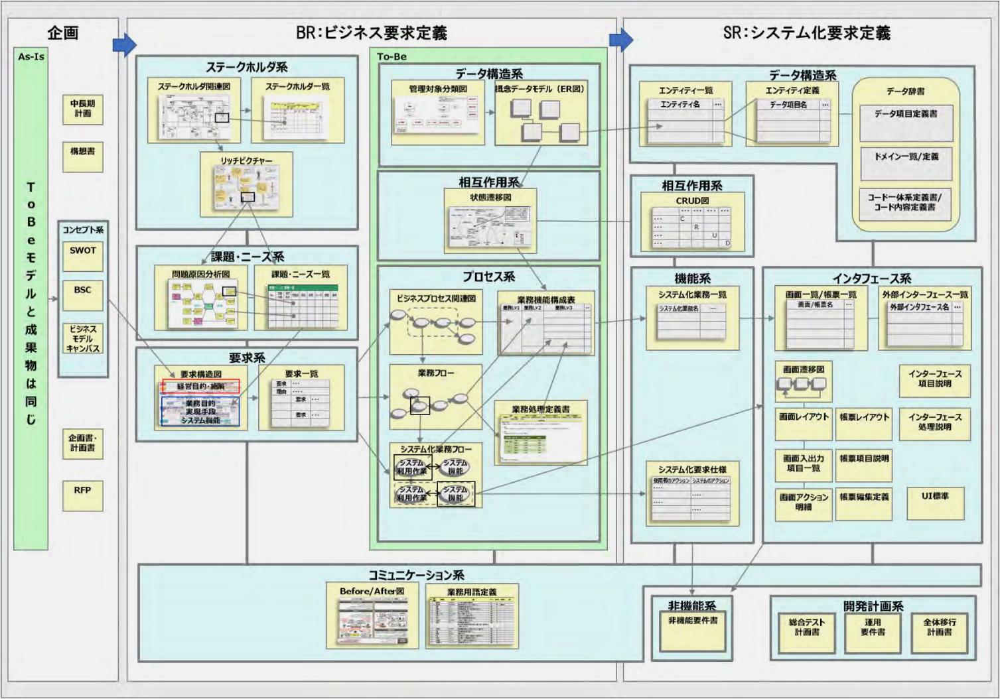

### 各図表のサンプル

#### [SWOT](https://www.ipa.go.jp/files/000079352.pdf#page=365)

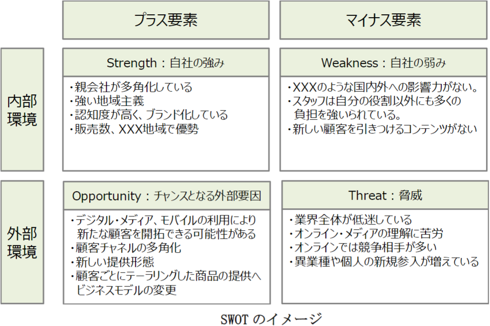

#### [リッチピクチャ](https://www.itmedia.co.jp/im/articles/0404/16/news083.html)

#### [ビジネスプロセス関連図](https://www.ipa.go.jp/files/000079352.pdf#page=395)

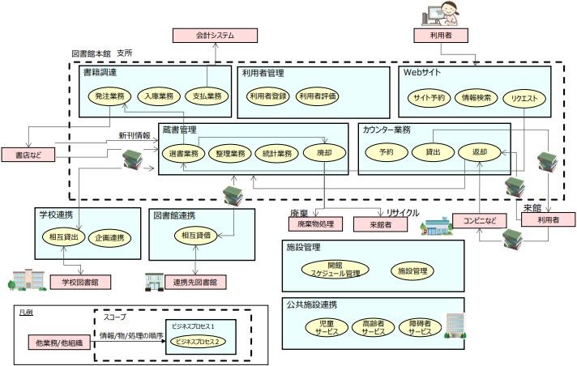

- 全体概要の把握
- プロジェクトのスコープの明確化
- 関係する外部組織・システムの関連について明確化
- 大きなビジネスプロセスの変更内容の把握

#### [業務機能構成表](https://www.ipa.go.jp/files/000079352.pdf#page=397)

- 業務の機能を一覧化し、抜け漏れを防止
- 対象業務をまとまりのあるプロセス単位でグループ化し、プロセスごとの業務機能の明確化

#### [ビジネスプロセスフロー（業務フロー）](https://www.ipa.go.jp/files/000079352.pdf#page=401)

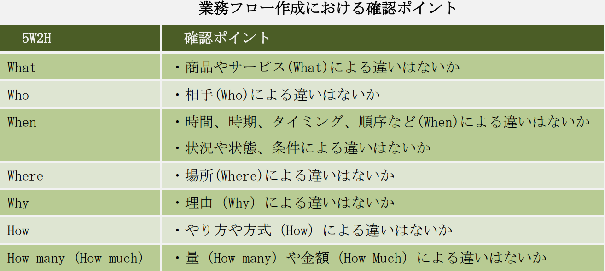
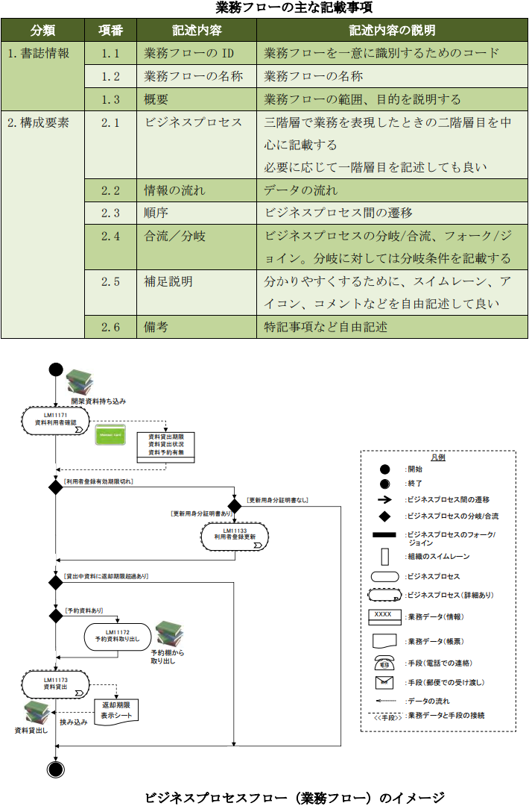

- 新しいビジネスプロセスを To-Be 業務フローとして表すことにより、新たなビジネスの流れを共通認識できる状態にする
- 現状のビジネスプロセスから As-Is 業務フローを作成し、現状の業務ビジネスフローの問題点や課題を共通認識できる状態にする

#### [システム化業務フロー](https://www.ipa.go.jp/files/000079352.pdf#page=404)

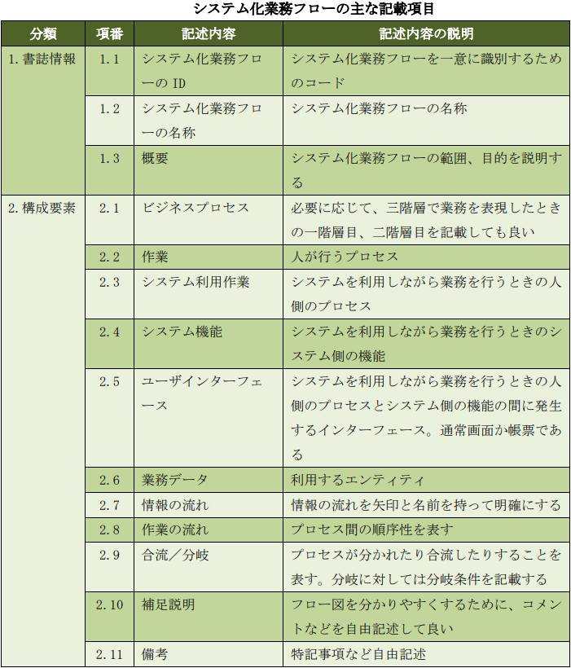
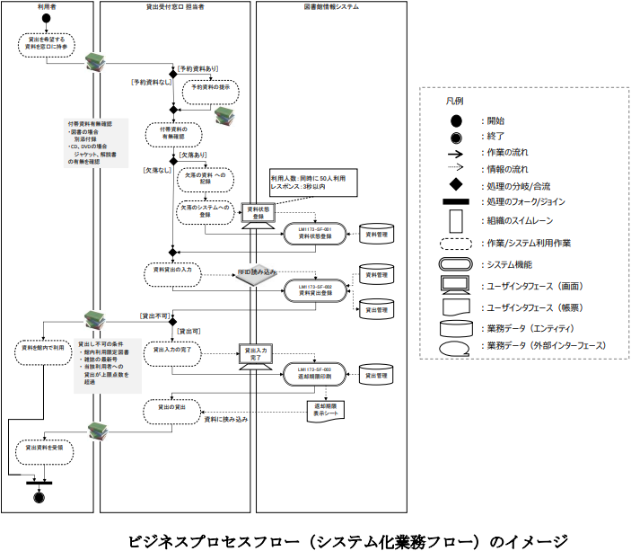

- 業務フローをもとに、人の作業とシステム機能を分けて記載して、必要なシステム機能を洗い出す
- 記載単位は以下のいずれか
  - 業務フローと同じ単位（ビジネスプロセス）で記載しても良いし、
  - 業務フローの 1 ビジネスプロセスのブレークダウン（構造化表現）

#### [業務処理定義](https://www.ipa.go.jp/files/000079352.pdf#page=408)

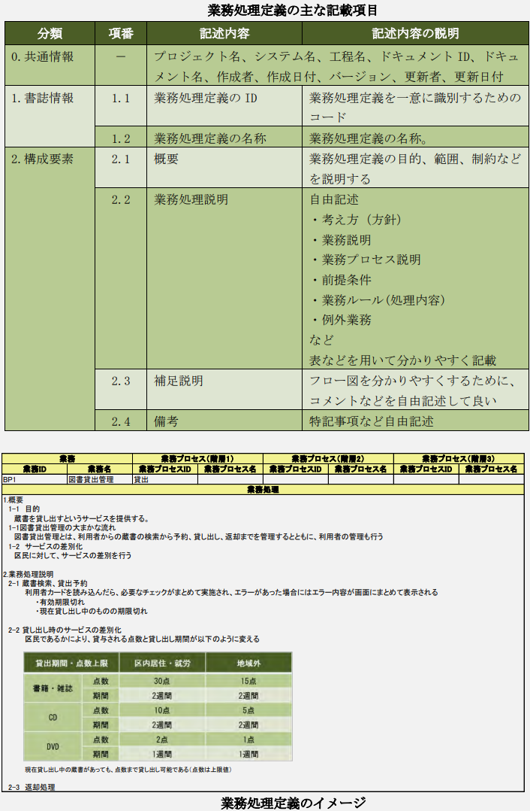

- フローでは記述しきれない業務処理の詳細内容を記述
- 業務フロー上の個々のボックス(業務機能)単位に作成され、業務機能とシステム機能を関係付ける

##### [USDM](https://www.ipa.go.jp/files/000079352.pdf#page=409)

要求と仕様を階層化して表形式で表現し、各「要求」と「要求の存在理由」をペアで記述する業務処理定義書の作成方法

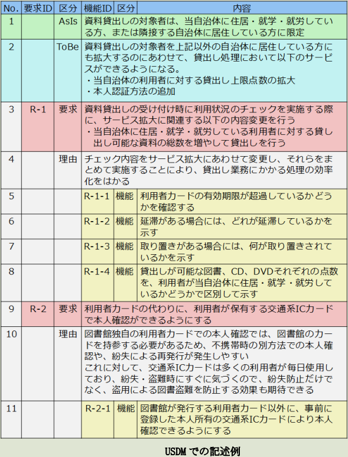

#### [用語定義](https://www.ipa.go.jp/files/000079352.pdf#page=413)

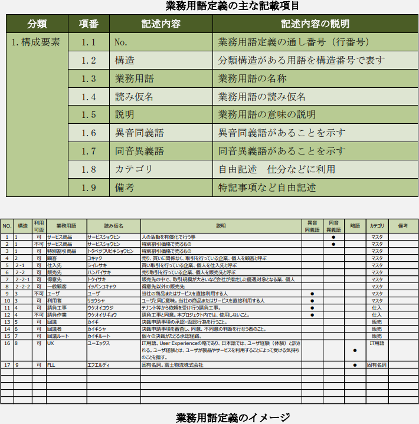

- 業務用語の一覧

#### [ビフォーアフター図](https://www.ipa.go.jp/files/000079352.pdf#page=414)

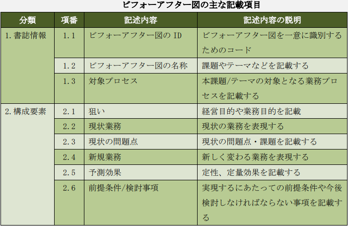
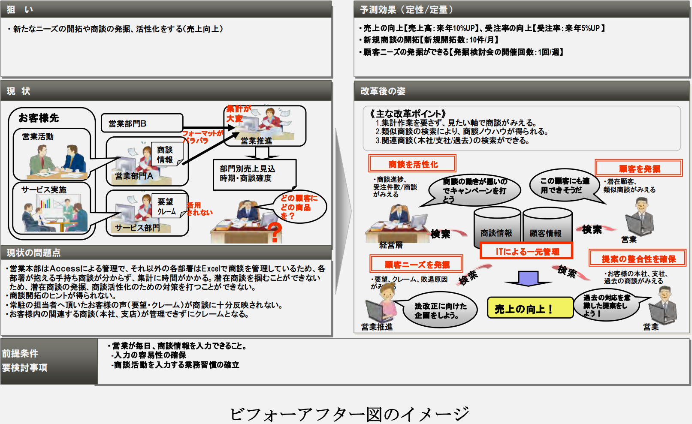

- 現在の業務と新しくなる業務を分かりやすく比較

#### [画面一覧](https://www.ipa.go.jp/files/000079352.pdf#page=420)

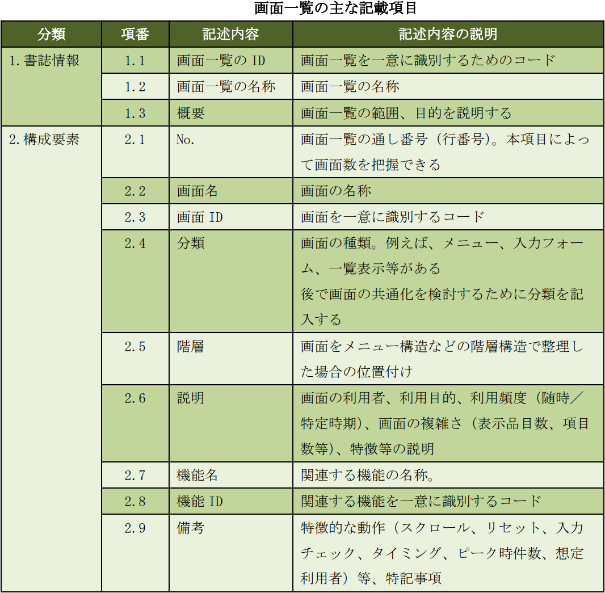
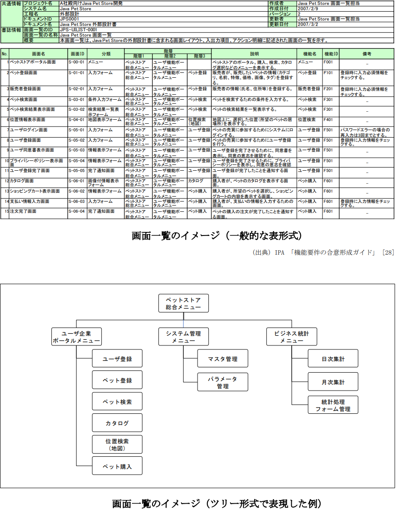

#### [帳票一覧](https://www.ipa.go.jp/files/000079352.pdf#page=422)

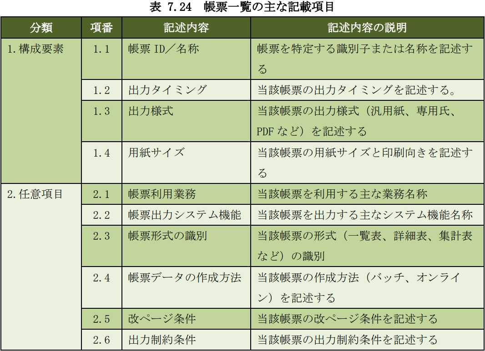

#### [エンティティ一覧](https://www.ipa.go.jp/files/000079352.pdf#page=425)

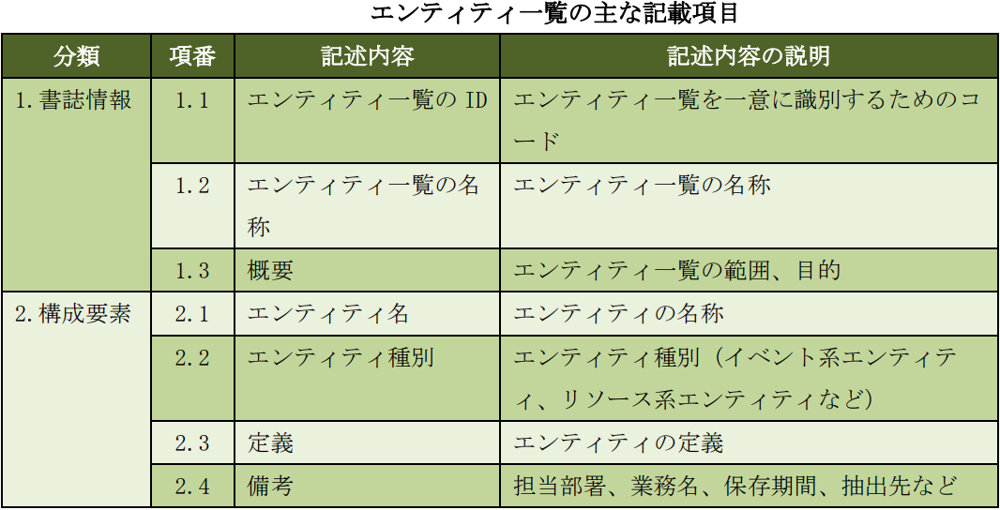

#### [外部インターフェース一覧](https://www.ipa.go.jp/files/000079352.pdf#page=423)

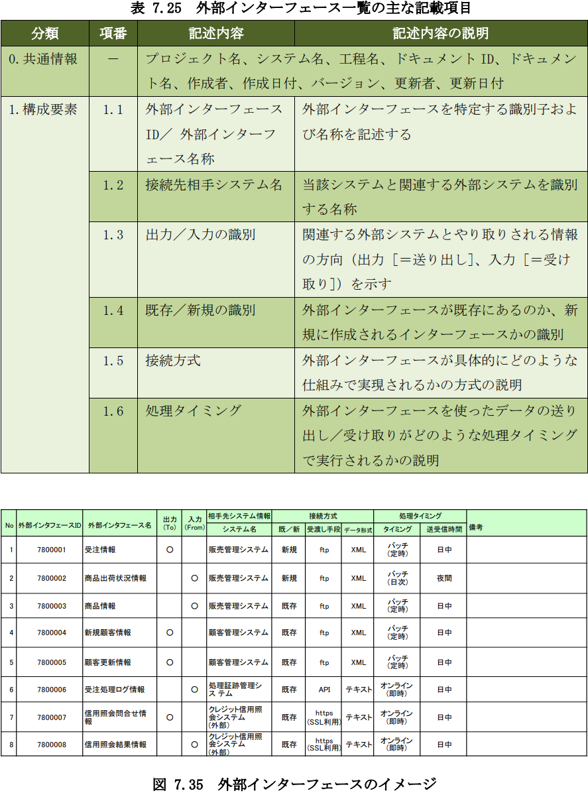

---

# 参考文献

- 特許庁
  - [特許庁システム設計・開発ガイドライン（システム刷新&システム構築編）（第1.6版）](https://www.jpo.go.jp/system/laws/sesaku/gyomu/system_kouchiku_16.html)
- IPA
  - [ユーザのための要件定義ガイド 第2版](https://www.ipa.go.jp/ikc/publish/tn19-002.html)

---

Copyright (c) 2022 YA-androidapp(https://github.com/YA-androidapp) All rights reserved.
