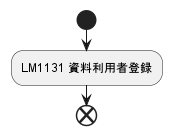

# Document-Template

開発ドキュメントのテンプレート

---

<!-- TOC -->

- [Document-Template](#document-template)
  - [ドキュメントの種類](#ドキュメントの種類)
    - [各図表のサンプル](#各図表のサンプル)
      - [V字モデル図](#v字モデル図)
      - [ビジネスプロセス関連図](#ビジネスプロセス関連図)
      - [業務機能構成表](#業務機能構成表)
      - [業務フロー](#業務フロー)
- [参考文献](#参考文献)

<!-- /TOC -->

---

## ドキュメントの種類

| 開発工程             | ドキュメント          | 内容       |                                                                                        |                                |
| -------------------- | --------------------- | ---------- | -------------------------------------------------------------------------------------- | ------------------------------ |
| 企画・受発注・準備   | RFI（情報提供依頼書） |            |                                                                                        |                                |
|                      |                       |            |                                                                                        |                                |
|                      | RFP（提案依頼書）     |            |                                                                                        |                                |
|                      |                       |            |                                                                                        |                                |
|                      | RFQ（見積依頼書）     |            |                                                                                        |                                |
|                      |                       |            |                                                                                        |                                |
|                      | 提案書                |            |                                                                                        |                                |
|                      |                       |            |                                                                                        |                                |
|                      | WBS                   |            |                                                                                        |                                |
|                      |                       |            |                                                                                        |                                |
|                      | プロジェクト計画書    |            | [V字モデル図](#v%E5%AD%97%E3%83%A2%E3%83%87%E3%83%AB%E5%9B%B3)                         |                                |
|                      |                       |            |                                                                                        |                                |
| 要件定義（要求分析） | 課題管理表            |            |                                                                                        |                                |
|                      |                       |            |                                                                                        |                                |
|                      | 要件定義書            | 業務要件   | 目的・背景                                                                             |                                |
| 基本設計（外部設計） | 基本設計書            |            | [ビジネスプロセス関連図](#ビジネスプロセス関連図)                                      |                                |
| 詳細設計（内部設計） | 詳細設計書（*）       |            | [業務機能構成表](#業務機能構成表)                                                      |                                |
|                      |                       |            | [ビジネスプロセスフロー（業務フロー）](#%E6%A5%AD%E5%8B%99%E3%83%95%E3%83%AD%E3%83%BC) |                                |
|                      |                       |            | システム化業務フロー                                                                   |                                |
|                      |                       |            | 業務処理定義書                                                                         |                                |
|                      |                       |            | 用語定義                                                                               |                                |
|                      |                       | 機能要件   | 方式                                                                                   | ハードウェア構成               |
|                      |                       |            |                                                                                        | ソフトウェア構成               |
|                      |                       |            |                                                                                        | ネットワーク構成               |
|                      |                       |            |                                                                                        | アプリケーション機能構成       |
|                      |                       |            | 画面・帳票                                                                             | 画面・帳票一覧                 |
|                      |                       |            |                                                                                        | 画面遷移図                     |
|                      |                       |            |                                                                                        | 画面・帳票レイアウト           |
|                      |                       |            |                                                                                        | 画面入出力・帳票出力項目 *     |
|                      |                       |            |                                                                                        | 画面アクション *               |
|                      |                       |            | バッチ                                                                                 | バッチ処理一覧                 |
|                      |                       |            |                                                                                        | バッチ処理フロー *             |
|                      |                       |            |                                                                                        | バッチ処理定義 *               |
|                      |                       |            | テーブル                                                                               | ER図                           |
|                      |                       |            |                                                                                        | テーブル一覧                   |
|                      |                       |            |                                                                                        | テーブル定義                   |
|                      |                       |            |                                                                                        | CRUD図 *                       |
|                      |                       |            | ファイル                                                                               | ファイル一覧                   |
|                      |                       |            |                                                                                        | ファイル定義                   |
|                      |                       |            | 外部インターフェース                                                                   | 外部システム関連図             |
|                      |                       |            |                                                                                        | 外部インターフェース一覧       |
|                      |                       |            |                                                                                        | 外部インターフェース定義       |
|                      |                       |            |                                                                                        | 外部インターフェース処理定義 * |
|                      |                       | 非機能要件 | 可用性                                                                                 |                                |
|                      |                       |            | 機能性                                                                                 |                                |
|                      |                       |            | 運用性                                                                                 |                                |
|                      |                       |            | 保守性                                                                                 |                                |
|                      |                       |            | 移行性                                                                                 |                                |
|                      |                       |            | セキュリティ                                                                           |                                |
|                      |                       |            |                                                                                        |                                |
|                      |                       | 業務要件   | 目的・背景                                                                             |                                |
|                      |                       |            | ビジネスプロセス関連図                                                                 |                                |
|                      |                       |            | 業務機能構成表                                                                         |                                |
|                      |                       |            | ビジネスプロセスフロー                                                                 |                                |
|                      |                       |            | システム化業務フロー                                                                   |                                |
|                      |                       |            | 業務処理定義書                                                                         |                                |
|                      |                       |            | 用語定義                                                                               |                                |
|                      |                       |            |                                                                                        |                                |
| 実装・単体テスト     | 単体テスト仕様書      |            |                                                                                        |                                |
|                      |                       |            |                                                                                        |                                |
|                      | 単体テスト結果報告書  |            |                                                                                        |                                |
|                      |                       |            |                                                                                        |                                |
| 結合テスト           | 結合テスト仕様書      |            |                                                                                        |                                |
|                      |                       |            |                                                                                        |                                |
|                      | 結合テスト結果報告書  |            |                                                                                        |                                |
|                      |                       |            |                                                                                        |                                |
| 総合テスト           | 総合テスト仕様書      |            |                                                                                        |                                |
| （システムテスト）   |                       |            |                                                                                        |                                |
|                      | 総合テスト結果報告書  |            |                                                                                        |                                |
|                      |                       |            |                                                                                        |                                |
| 受入テスト           | システム移行計画書    |            |                                                                                        |                                |
|                      |                       |            |                                                                                        |                                |
|                      | 受入テスト仕様書      |            |                                                                                        |                                |
|                      |                       |            |                                                                                        |                                |
|                      | 検収書                |            |                                                                                        |                                |
|                      |                       |            |                                                                                        |                                |

### 各図表のサンプル

#### V字モデル図

#### ビジネスプロセス関連図

#### 業務機能構成表

| ビジネスプロセス1                | ビジネスプロセス2     | 作業                 | システム利用作業             | 概要                                         | 利用者 管理者 |  ログインユーザー |  ゲストユーザー | 備考        |
| -------------------------------- | --------------------- | -------------------- | ---------------------------- | -------------------------------------------- | ---------------- | -------------------- | ------------------ | ----------- |
| LM11 資料利用管理                |                       |                      |                              |                                              |                  |                      |                    |             |
| &nbsp;&nbsp;LM111 資料利用者管理 | LM1131 資料利用者登録 | 資料利用者を登録     | LM1131-SF-001 利用者情報登録 | 利用者を本人確認の上で登録                   | 〇               |                      |                    |             |
|                                  | LM1132 利用者PW登録   | 利用者がPWを登録     | LM1132-SF-001 利用者登録更新 | 利用者本人がパスワードを設定                 |                  | 〇                   |                    | Webサービス |
|                                  | LM1133 利用者更新     | 利用者情報を更新     | LM1133-SF-001 利用者登録更新 | 利用者情報を本人確認の上で更新               | 〇               |                      |                    |             |
| &nbsp;&nbsp;LM112 資料貸出予約   | LM1121 資料照会       | 資料の貸出状況を検索 | LM1121-SF-001 資料検索       | 蔵書を検索                                   | 〇               | 〇                   | 〇                 |             |
|                                  | LM1122 資料貸出予約   | 資料の貸出を予約     | LM1122-SF-001 貸出予約       | 資料を貸出予約                               | 〇               | 〇                   |                    |             |
|                                  | LM1123 貸出予約取消   | 貸出予約を取消       | LM1123-SF-001 貸出予約取消   | 自身の貸出予約を取消                         | 〇               | 〇                   |                    |             |
|                                  | LM1124 貸出期間延長   | 貸出予約状況を検索   | LM1124-SF-001 貸出予約検索   | 他の利用者の貸出予約を検索                   | 〇               | 〇                   |                    |             |
|                                  |                       | 貸出期間を延長       | LM1124-SF-002 貸出期間延長   | 他の利用者が予約していなければ貸出期間を延長 | 〇               | 〇                   |                    |             |
|                                  |                       |                      |                              |                                              |                  |                      |                    |             |

#### 業務フロー

ビジネスプロセスフロー

---

# 参考文献

- 特許庁
  - [特許庁システム設計・開発ガイドライン（システム刷新&システム構築編）（第1.6版）](https://www.jpo.go.jp/system/laws/sesaku/gyomu/system_kouchiku_16.html)
- IPA
  - [ユーザのための要件定義ガイド 第2版](https://www.ipa.go.jp/ikc/publish/tn19-002.html)

---

Copyright (c) 2022 YA-androidapp(https://github.com/YA-androidapp) All rights reserved.
