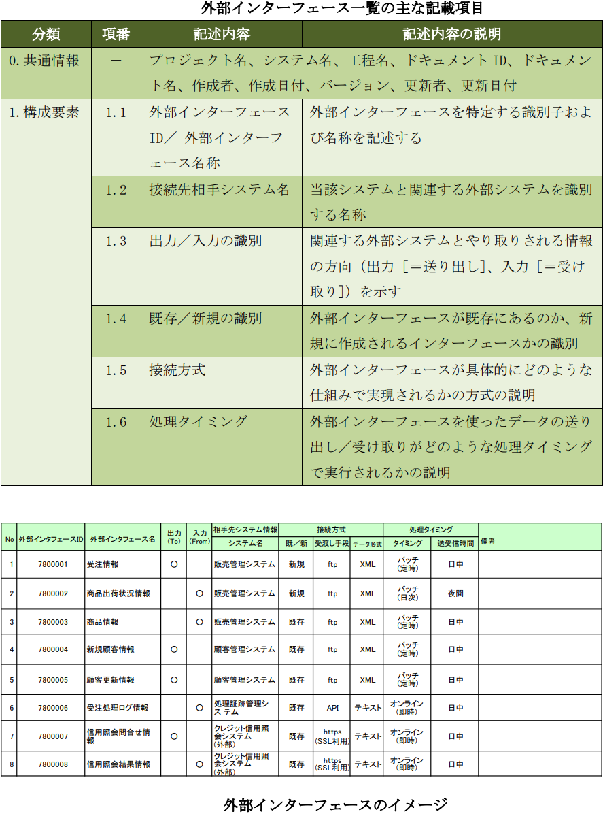

# Document-Template

開発ドキュメントのテンプレート

---

<!-- TOC -->

- [Document-Template](#document-template)
    - [ドキュメントの種類](#%E3%83%89%E3%82%AD%E3%83%A5%E3%83%A1%E3%83%B3%E3%83%88%E3%81%AE%E7%A8%AE%E9%A1%9E)
    - [SWOT](#swot)
    - [バランススコアカード（BSC）](#%E3%83%90%E3%83%A9%E3%83%B3%E3%82%B9%E3%82%B9%E3%82%B3%E3%82%A2%E3%82%AB%E3%83%BC%E3%83%89bsc)
    - [ビジネスモデルキャンパス](#%E3%83%93%E3%82%B8%E3%83%8D%E3%82%B9%E3%83%A2%E3%83%87%E3%83%AB%E3%82%AD%E3%83%A3%E3%83%B3%E3%83%91%E3%82%B9)
    - [ステークホルダ関係図](#%E3%82%B9%E3%83%86%E3%83%BC%E3%82%AF%E3%83%9B%E3%83%AB%E3%83%80%E9%96%A2%E4%BF%82%E5%9B%B3)
    - [ステークホルダ一覧](#%E3%82%B9%E3%83%86%E3%83%BC%E3%82%AF%E3%83%9B%E3%83%AB%E3%83%80%E4%B8%80%E8%A6%A7)
    - [リッチピクチャ](#%E3%83%AA%E3%83%83%E3%83%81%E3%83%94%E3%82%AF%E3%83%81%E3%83%A3)
    - [問題・ニーズ・課題一覧](#%E5%95%8F%E9%A1%8C%E3%83%BB%E3%83%8B%E3%83%BC%E3%82%BA%E3%83%BB%E8%AA%B2%E9%A1%8C%E4%B8%80%E8%A6%A7)
    - [問題原因分析図](#%E5%95%8F%E9%A1%8C%E5%8E%9F%E5%9B%A0%E5%88%86%E6%9E%90%E5%9B%B3)
    - [要求構造図](#%E8%A6%81%E6%B1%82%E6%A7%8B%E9%80%A0%E5%9B%B3)
    - [要求一覧](#%E8%A6%81%E6%B1%82%E4%B8%80%E8%A6%A7)
    - [管理対象分類図](#%E7%AE%A1%E7%90%86%E5%AF%BE%E8%B1%A1%E5%88%86%E9%A1%9E%E5%9B%B3)
    - [概念データモデル（ER 図）](#%E6%A6%82%E5%BF%B5%E3%83%87%E3%83%BC%E3%82%BF%E3%83%A2%E3%83%87%E3%83%ABer-%E5%9B%B3)
        - [概念データモデルの記載範囲](#%E6%A6%82%E5%BF%B5%E3%83%87%E3%83%BC%E3%82%BF%E3%83%A2%E3%83%87%E3%83%AB%E3%81%AE%E8%A8%98%E8%BC%89%E7%AF%84%E5%9B%B2)
        - [カージナリティ](#%E3%82%AB%E3%83%BC%E3%82%B8%E3%83%8A%E3%83%AA%E3%83%86%E3%82%A3)
        - [概念データモデルから業務を読み取る](#%E6%A6%82%E5%BF%B5%E3%83%87%E3%83%BC%E3%82%BF%E3%83%A2%E3%83%87%E3%83%AB%E3%81%8B%E3%82%89%E6%A5%AD%E5%8B%99%E3%82%92%E8%AA%AD%E3%81%BF%E5%8F%96%E3%82%8B)
            - [分類を読み取る](#%E5%88%86%E9%A1%9E%E3%82%92%E8%AA%AD%E3%81%BF%E5%8F%96%E3%82%8B)
            - [カージナリティ（多重度）を読み取る](#%E3%82%AB%E3%83%BC%E3%82%B8%E3%83%8A%E3%83%AA%E3%83%86%E3%82%A3%E5%A4%9A%E9%87%8D%E5%BA%A6%E3%82%92%E8%AA%AD%E3%81%BF%E5%8F%96%E3%82%8B)
            - [業務の違いと概念データモデルの違い](#%E6%A5%AD%E5%8B%99%E3%81%AE%E9%81%95%E3%81%84%E3%81%A8%E6%A6%82%E5%BF%B5%E3%83%87%E3%83%BC%E3%82%BF%E3%83%A2%E3%83%87%E3%83%AB%E3%81%AE%E9%81%95%E3%81%84)
    - [ビジネスプロセス関連図](#%E3%83%93%E3%82%B8%E3%83%8D%E3%82%B9%E3%83%97%E3%83%AD%E3%82%BB%E3%82%B9%E9%96%A2%E9%80%A3%E5%9B%B3)
    - [業務機能構成表](#%E6%A5%AD%E5%8B%99%E6%A9%9F%E8%83%BD%E6%A7%8B%E6%88%90%E8%A1%A8)
    - [ビジネスプロセスフロー（業務フロー）](#%E3%83%93%E3%82%B8%E3%83%8D%E3%82%B9%E3%83%97%E3%83%AD%E3%82%BB%E3%82%B9%E3%83%95%E3%83%AD%E3%83%BC%E6%A5%AD%E5%8B%99%E3%83%95%E3%83%AD%E3%83%BC)
    - [システム化業務フロー](#%E3%82%B7%E3%82%B9%E3%83%86%E3%83%A0%E5%8C%96%E6%A5%AD%E5%8B%99%E3%83%95%E3%83%AD%E3%83%BC)
    - [業務処理定義](#%E6%A5%AD%E5%8B%99%E5%87%A6%E7%90%86%E5%AE%9A%E7%BE%A9)
        - [USDM](#usdm)
    - [状態遷移図](#%E7%8A%B6%E6%85%8B%E9%81%B7%E7%A7%BB%E5%9B%B3)
    - [用語定義](#%E7%94%A8%E8%AA%9E%E5%AE%9A%E7%BE%A9)
    - [ビフォーアフター図](#%E3%83%93%E3%83%95%E3%82%A9%E3%83%BC%E3%82%A2%E3%83%95%E3%82%BF%E3%83%BC%E5%9B%B3)
    - [画面一覧](#%E7%94%BB%E9%9D%A2%E4%B8%80%E8%A6%A7)
    - [帳票一覧](#%E5%B8%B3%E7%A5%A8%E4%B8%80%E8%A6%A7)
    - [エンティティ一覧](#%E3%82%A8%E3%83%B3%E3%83%86%E3%82%A3%E3%83%86%E3%82%A3%E4%B8%80%E8%A6%A7)
    - [外部インターフェース一覧](#%E5%A4%96%E9%83%A8%E3%82%A4%E3%83%B3%E3%82%BF%E3%83%BC%E3%83%95%E3%82%A7%E3%83%BC%E3%82%B9%E4%B8%80%E8%A6%A7)
- [参考文献](#%E5%8F%82%E8%80%83%E6%96%87%E7%8C%AE)

<!-- /TOC -->

---

## ドキュメントの種類

| 開発工程             | ドキュメント                 | 内容                   |                               |                                       |
| -------------------- | ---------------------------- | ---------------------- | ----------------------------- | ------------------------------------- |
| 企画・受発注・準備   | RFI（情報提供依頼書）        |                        |                               |                                       |
|                      |                              |                        |                               |                                       |
|                      | RFP（提案依頼書）            |                        |                               |                                       |
|                      |                              |                        |                               |                                       |
|                      | RFQ（見積依頼書）            |                        |                               |                                       |
|                      |                              |                        |                               |                                       |
|                      | 提案書                       | 提案の背景             | 現状認識                      |                                       |
|                      |                              |                        | 現状の課題                    |                                       |
|                      |                              |                        | 導入目的                      |                                       |
|                      |                              |                        | 導入効果                      |                                       |
|                      |                              |                        | 導入における課題              |                                       |
|                      |                              |                        | 実現方法                      |                                       |
|                      |                              |                        | 対象範囲・領域                |                                       |
|                      |                              | 提案システム           | システム構成                  |                                       |
|                      |                              |                        | システム導入後の業務フロー    |                                       |
|                      |                              |                        | システムの前提条件            |                                       |
|                      |                              |                        | システムの範囲                |                                       |
|                      |                              | プロジェクト管理       | プロジェクトの進め方          |                                       |
|                      |                              |                        | 成果物                        |                                       |
|                      |                              |                        | 開発体制                      |                                       |
|                      |                              |                        | 開発スケジュール              |                                       |
|                      |                              |                        | 想定コスト                    |                                       |
|                      |                              |                        |                               |                                       |
|                      | WBS                          |                        |                               |                                       |
|                      |                              |                        |                               |                                       |
|                      | 契約書                       |                        |                               |                                       |
|                      |                              |                        |                               |                                       |
|                      | プロジェクト計画書           | プロジェクト概要       | プロジェクトの目的            |                                       |
|                      |                              |                        | 目標（QCD；品質、費用、期限） |                                       |
|                      |                              |                        | 作業範囲（スコープ）          |                                       |
|                      |                              |                        | 成果物                        |                                       |
|                      |                              |                        | 項目ごとのコスト              | 人件費                                |
|                      |                              |                        |                               | 外注費                                |
|                      |                              |                        |                               | ソフトウェア費用                      |
|                      |                              |                        |                               | ハードウェア費用                      |
|                      |                              |                        |                               | インフラ／クラウド費用                |
|                      |                              |                        |                               | 保守費用                              |
|                      |                              |                        |                               | ライセンス費用                        |
|                      |                              |                        |                               | 消耗品／備品費用                      |
|                      |                              |                        | スケジュール・タスク          | WBS（抜粋）                           |
|                      |                              |                        |                               | V字モデル図                           |
|                      |                              |                        |                               | マイルストーン                        |
|                      |                              |                        | 体制図                        | 自社側                                |
|                      |                              |                        |                               | 顧客側                                |
|                      |                              |                        |                               | 責任者・営業窓口                      |
|                      |                              |                        |                               | メンバーの役割                        |
|                      |                              |                        | コミュニケーションルール      | 会議体（名称・参加者・目的・日程）    |
|                      |                              |                        |                               | メールの宛先・件名・添付ファイル      |
|                      |                              |                        |                               | チャットツールのテナント・チーム      |
|                      |                              |                        |                               | 議事録の書式・作成者                  |
|                      |                              |                        | 品質管理                      | 品質管理基準                          |
|                      |                              |                        |                               | レビュー計画                          |
|                      |                              |                        |                               | テスト計画                            |
|                      |                              |                        |                               | 文書管理ルール                        |
|                      |                              |                        | リスクと対応方針              | リスクの内容・発生確率・頻度・重要度  |
|                      |                              |                        |                               | リスクへの対応方法                    |
|                      |                              |                        |                               |                                       |
| 要件定義（要求分析） | 課題管理表                   |                        |                               |                                       |
|                      |                              |                        |                               |                                       |
|                      | 要件定義書                   | 業務要件               | 目的・背景                    |                                       |
| 基本設計（外部設計） | 基本設計書                   |                        |                               |                                       |
| 詳細設計（内部設計） | 詳細設計書（*）              |                        |                               |                                       |
|                      |                              |                        |                               |                                       |
|                      |                              |                        | ビジネスコンセプト            | SWOT                                  |
|                      |                              |                        |                               | バランススコアカード                  |
|                      |                              |                        |                               | ビジネスモデルキャンパス              |
|                      |                              |                        | ステークホルダ                | ステークホルダ関係図                  |
|                      |                              |                        |                               | ステークホルダ一覧                    |
|                      |                              |                        |                               | リッチピクチャ                        |
|                      |                              |                        | 要求分析                      | 問題・ニーズ・課題一覧                |
|                      |                              |                        |                               | 問題原因分析図                        |
|                      |                              |                        |                               | 要求構造図                            |
|                      |                              |                        |                               | 要求一覧                              |
|                      |                              |                        | データモデル                  | 管理対象分類図                        |
|                      |                              |                        |                               | 概念データモデル（ER 図）             |
|                      |                              |                        | ビジネスプロセスモデル        | ビジネスプロセス関連図                |
|                      |                              |                        |                               | 業務機能構成表                        |
|                      |                              |                        |                               | ビジネスプロセスフロー（業務フロー）  |
|                      |                              |                        |                               | システム化業務フロー                  |
|                      |                              |                        |                               | 業務処理定義                          |
|                      |                              |                        | 相互作用モデル                | 状態遷移図                            |
|                      |                              |                        | コミュニケーション            | 業務用語定義                          |
|                      |                              |                        |                               | ビフォーアフター図                    |
|                      |                              |                        |                               |                                       |
|                      |                              | 機能要件               | 方式                          | ハードウェア構成                      |
|                      |                              |                        |                               | ソフトウェア構成                      |
|                      |                              |                        |                               | ネットワーク構成                      |
|                      |                              |                        |                               | アプリケーション機能構成              |
|                      |                              |                        | 画面・帳票                    | 画面・帳票一覧                        |
|                      |                              |                        |                               | 画面入出力・帳票出力項目 *            |
|                      |                              |                        |                               | 画面アクション *                      |
|                      |                              |                        | バッチ                        | バッチ処理一覧                        |
|                      |                              |                        |                               | バッチ処理フロー *                    |
|                      |                              |                        |                               | バッチ処理定義 *                      |
|                      |                              |                        | インターフェース              | 外部システム関連図                    |
|                      |                              |                        |                               | システム化要求仕様                    |
|                      |                              |                        |                               | UI標準                                |
|                      |                              |                        |                               | 画面遷移図                            |
|                      |                              |                        |                               | 画面・帳票レイアウト                  |
|                      |                              |                        |                               | 外部インターフェース一覧              |
|                      |                              |                        |                               | 外部インターフェース定義              |
|                      |                              |                        |                               | 外部インターフェース処理定義 *        |
|                      |                              |                        | テーブル（データ定義）        | ER図                                  |
|                      |                              |                        |                               | エンティティ一覧 *                    |
|                      |                              |                        |                               | エンティティ定義／データ項目定義 *    |
|                      |                              |                        |                               | テーブル一覧 *                        |
|                      |                              |                        |                               | テーブル定義 *                        |
|                      |                              |                        |                               | ドメイン定義                          |
|                      |                              |                        |                               | コード体系定義                        |
|                      |                              |                        |                               | コード内容定義 *                      |
|                      |                              |                        |                               | CRUD図 *                              |
|                      |                              |                        | ファイル                      | ファイル一覧 *                        |
|                      |                              |                        |                               | ファイル定義 *                        |
|                      | 非機能要件書                 | 非機能要件             | 可用性                        |                                       |
|                      |                              |                        | 機能性                        |                                       |
|                      |                              |                        | 運用性                        |                                       |
|                      |                              |                        | 保守性                        |                                       |
|                      |                              |                        | 移行性                        |                                       |
|                      |                              |                        | セキュリティ                  |                                       |
|                      |                              |                        |                               |                                       |
|                      | 運用要件書                   |                        |                               |  |
|                      |                              |                        |                               |                                       |
| 実装・単体テスト     | 単体テスト仕様書             | テストケース           | テストケース概要              |                                       |
|                      |                              |                        | 前提条件                      |                                       |
|                      |                              |                        | 実行手順                      |                                       |
|                      |                              |                        | 入力値                        |                                       |
|                      |                              |                        | 期待値                        |                                       |
|                      |                              |                        |                               |                                       |
|                      |                              | デシジョンテーブル     |                               | （条件分岐のパターンを列挙）          |
|                      |                              |                        |                               |                                       |
|                      | 単体テスト結果報告書         | 単体テスト仕様書の項目 |                               |                                       |
|                      |                              | 実行日、実行者         |                               |                                       |
|                      |                              | 改修日                 |                               |                                       |
|                      |                              | 再実行日               |                               |                                       |
|                      |                              | 課題管理表No           |                               |                                       |
|                      |                              |                        |                               |                                       |
| 結合テスト           | 結合テスト仕様書             | テストシナリオ         | テストシナリオ概要            |                                       |
|                      |                              |                        | 前提条件                      |                                       |
|                      |                              |                        | 実行手順                      |                                       |
|                      |                              |                        | 入力値                        |                                       |
|                      |                              |                        | 期待値                        |                                       |
|                      |                              |                        |                               |                                       |
|                      | 結合テスト結果報告書         | 結合テスト仕様書の項目 |                               |                                       |
|                      |                              | 実行日、実行者         |                               |                                       |
|                      |                              | 改修日                 |                               |                                       |
|                      |                              | 再実行日               |                               |                                       |
|                      |                              | 課題管理表No           |                               |                                       |
|                      |                              |                        |                               |                                       |
| 総合テスト           | 機能テスト                   |                        |                               |                                       |
| （システムテスト）   | 性能テスト                   |                        |                               |                                       |
|                      | ユーザビリティテスト         |                        |                               |                                       |
|                      | セキュリティテスト           |                        |                               |                                       |
|                      | 回帰（リグレッション）テスト |                        |                               |                                       |
|                      |                              |                        |                               |                                       |
|                      |                              |                        |                               |                                       |
|                      |                              |                        |                               |                                       |
|                      |                              |                        |                               |                                       |
|                      |                              |                        |                               |                                       |
|                      |                              |                        |                               |                                       |
|                      | 総合テスト仕様書             |                        |                               |  |
|                      |                              |                        |                               |                                       |
|                      | 総合テスト結果報告書         |                        |                               |                                       |
|                      |                              |                        |                               |                                       |
| 受入テスト           | システム移行計画書           |                        |                               |  |
|                      |                              |                        |                               |                                       |
|                      | 受入テスト仕様書             |                        |                               |                                       |
|                      |                              |                        |                               |                                       |
|                      | 検収書                       |                        |                               |                                       |
|                      |                              |                        |                               |                                       |

## [SWOT](https://www.ipa.go.jp/files/000079352.pdf#page=365)

- 自社の内部環境と外部環境の分析を統合的に行い、自社のビジネスの機会を発見

## [バランススコアカード（BSC）](https://www.ipa.go.jp/files/000079352.pdf#page=366)

- 「財務」「顧客」「社内ビジネスプロセス」「学習と成長」の4つの視点で、戦略実行や業績評価を行うための手法

## [ビジネスモデルキャンパス](https://www.ipa.go.jp/files/000079352.pdf#page=367)

ビジネスの全体像を表す。

## [ステークホルダ関係図](https://www.ipa.go.jp/files/000079352.pdf#page=369)

## [ステークホルダ一覧](https://www.ipa.go.jp/files/000079352.pdf#page=370)

## [リッチピクチャ](https://www.ipa.go.jp/files/000079352.pdf#page=372)

## [問題・ニーズ・課題一覧](https://www.ipa.go.jp/files/000079352.pdf#page=375)

- 問題ごとの、抽出先、問題、原因、影響、ニーズ、課題を一覧化

## [問題原因分析図](https://www.ipa.go.jp/files/000079352.pdf#page=376)

- 抽出された問題の原因を繰り返し表現（なぜなぜ分析）し因果関係を明確化
- なぜなぜは、制約（人の問題、お金の問題など）に行き着いたらやめる

## [要求構造図](https://www.ipa.go.jp/files/000079352.pdf#page=378)

- 要求（目的/手段）を経営目的、経営施策、業務目的、実現手段、システム機能に区別して表現し、その関係を描く

## [要求一覧](https://www.ipa.go.jp/files/000079352.pdf#page=380)

- 要求（経営目的、経営施策、業務目的、実現手段、システム機能）を一覧にしたもの

## [管理対象分類図](https://www.ipa.go.jp/files/000079352.pdf#page=383)

- 管理対象をミーシー(MECE; 漏れなく重複なく)になるように分類し定義したもの

## [ 概念データモデル（ER 図）](https://www.ipa.go.jp/files/000079352.pdf#page=385)

- 業務をデータ構造の観点から表現
- データベース設計のER図より抽象度が高い

### 概念データモデルの記載範囲

|              | 企画プロセス     | 要件定義プロセス | システム要件定義プロセス |
| ------------ | ---------------- | ---------------- | ------------------------ |
| エンティティ | 主要エンティティ | 全エンティティ   | 全エンティティ           |
| データ項目   | 主要データ項目   | 主要データ項目   | 全データ項目             |

### カージナリティ

### 概念データモデルから業務を読み取る

#### 分類を読み取る

#### カージナリティ（多重度）を読み取る

#### 業務の違いと概念データモデルの違い

## [ビジネスプロセス関連図](https://www.ipa.go.jp/files/000079352.pdf#page=395)

- 全体概要の把握
- プロジェクトのスコープの明確化
- 関係する外部組織・システムの関連について明確化
- 大きなビジネスプロセスの変更内容の把握

## [業務機能構成表](https://www.ipa.go.jp/files/000079352.pdf#page=397)

- 業務の機能を一覧化し、抜け漏れを防止
- 対象業務をまとまりのあるプロセス単位でグループ化し、プロセスごとの業務機能の明確化

## [ビジネスプロセスフロー（業務フロー）](https://www.ipa.go.jp/files/000079352.pdf#page=401)

- 新しいビジネスプロセスを To-Be 業務フローとして表すことにより、新たなビジネスの流れを共通認識できる状態にする
- 現状のビジネスプロセスから As-Is 業務フローを作成し、現状の業務ビジネスフローの問題点や課題を共通認識できる状態にする

## [システム化業務フロー](https://www.ipa.go.jp/files/000079352.pdf#page=404)

- 業務フローをもとに、人の作業とシステム機能を分けて記載して、必要なシステム機能を洗い出す
- 記載単位は以下のいずれか
  - 業務フローと同じ単位（ビジネスプロセス）で記載しても良いし、
  - 業務フローの 1 ビジネスプロセスのブレークダウン（構造化表現）

## [業務処理定義](https://www.ipa.go.jp/files/000079352.pdf#page=408)

- フローでは記述しきれない業務処理の詳細内容を記述
- 業務フロー上の個々のボックス(業務機能)単位に作成され、業務機能とシステム機能を関係付ける

### [USDM](https://www.ipa.go.jp/files/000079352.pdf#page=409)

要求と仕様を階層化して表形式で表現し、各「要求」と「要求の存在理由」をペアで記述する業務処理定義書の作成方法

## [状態遷移図](https://www.ipa.go.jp/files/000079352.pdf#page=410)

- エンティティの状態が変わっていく様子を図示

## [用語定義](https://www.ipa.go.jp/files/000079352.pdf#page=413)

- 業務用語の一覧

## [ビフォーアフター図](https://www.ipa.go.jp/files/000079352.pdf#page=414)

- 現在の業務と新しくなる業務を分かりやすく比較

## [画面一覧](https://www.ipa.go.jp/files/000079352.pdf#page=420)

## [帳票一覧](https://www.ipa.go.jp/files/000079352.pdf#page=422)

## [エンティティ一覧](https://www.ipa.go.jp/files/000079352.pdf#page=425)

## [外部インターフェース一覧](https://www.ipa.go.jp/files/000079352.pdf#page=423)

---

# 参考文献

- 特許庁
  - [特許庁システム設計・開発ガイドライン（システム刷新&システム構築編）（第1.6版）](https://www.jpo.go.jp/system/laws/sesaku/gyomu/system_kouchiku_16.html)
- IPA
  - [ユーザのための要件定義ガイド 第2版](https://www.ipa.go.jp/ikc/publish/tn19-002.html)

---

Copyright (c) 2022 YA-androidapp(https://github.com/YA-androidapp) All rights reserved.
