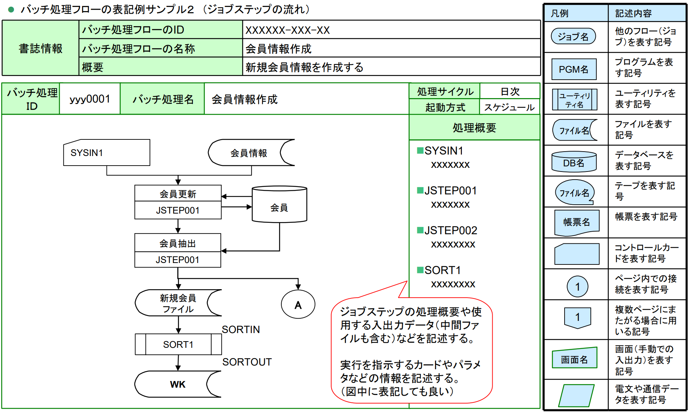
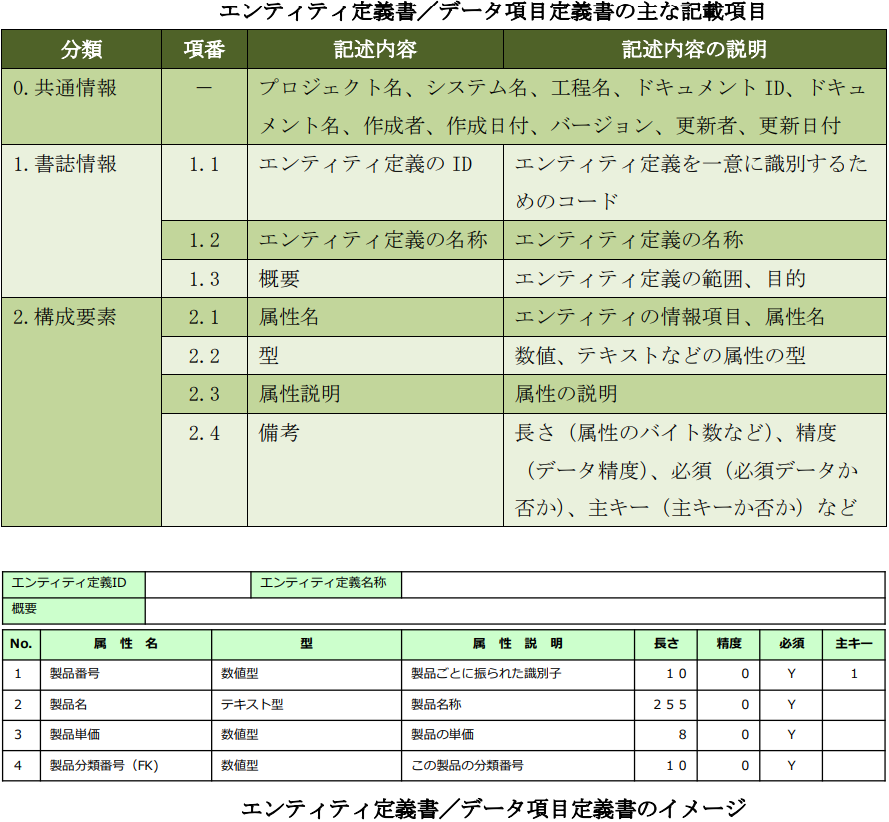
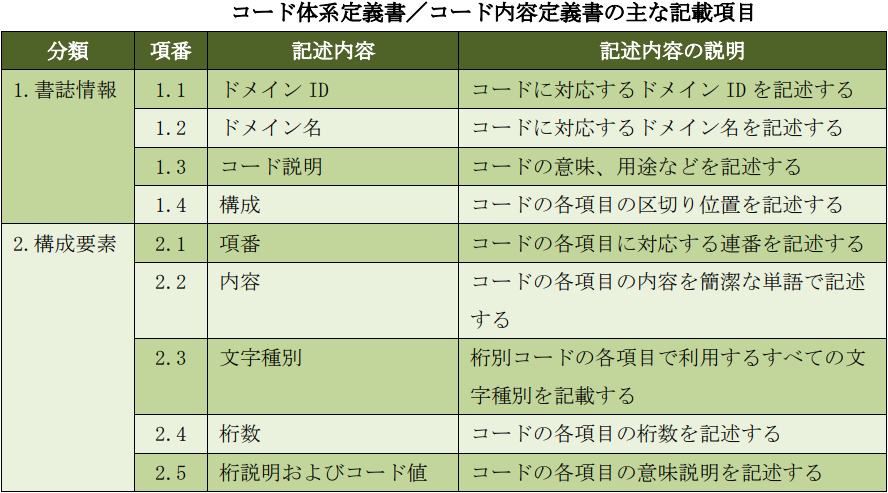

# Document-Template

開発ドキュメントのテンプレート

---

<!-- TOC -->

- [Document-Template](#document-template)
    - [ドキュメントの種類](#%E3%83%89%E3%82%AD%E3%83%A5%E3%83%A1%E3%83%B3%E3%83%88%E3%81%AE%E7%A8%AE%E9%A1%9E)
    - [事業システム全体図](#%E4%BA%8B%E6%A5%AD%E3%82%B7%E3%82%B9%E3%83%86%E3%83%A0%E5%85%A8%E4%BD%93%E5%9B%B3)
        - [ビジネス機能関連図](#%E3%83%93%E3%82%B8%E3%83%8D%E3%82%B9%E6%A9%9F%E8%83%BD%E9%96%A2%E9%80%A3%E5%9B%B3)
        - [ビジネス連携図](#%E3%83%93%E3%82%B8%E3%83%8D%E3%82%B9%E9%80%A3%E6%90%BA%E5%9B%B3)
    - [SWOT](#swot)
    - [バランススコアカード（BSC）](#%E3%83%90%E3%83%A9%E3%83%B3%E3%82%B9%E3%82%B9%E3%82%B3%E3%82%A2%E3%82%AB%E3%83%BC%E3%83%89bsc)
    - [ビジネスモデルキャンパス](#%E3%83%93%E3%82%B8%E3%83%8D%E3%82%B9%E3%83%A2%E3%83%87%E3%83%AB%E3%82%AD%E3%83%A3%E3%83%B3%E3%83%91%E3%82%B9)
    - [ステークホルダ関係図](#%E3%82%B9%E3%83%86%E3%83%BC%E3%82%AF%E3%83%9B%E3%83%AB%E3%83%80%E9%96%A2%E4%BF%82%E5%9B%B3)
    - [ステークホルダ一覧](#%E3%82%B9%E3%83%86%E3%83%BC%E3%82%AF%E3%83%9B%E3%83%AB%E3%83%80%E4%B8%80%E8%A6%A7)
    - [リッチピクチャ](#%E3%83%AA%E3%83%83%E3%83%81%E3%83%94%E3%82%AF%E3%83%81%E3%83%A3)
    - [問題・ニーズ・課題一覧](#%E5%95%8F%E9%A1%8C%E3%83%BB%E3%83%8B%E3%83%BC%E3%82%BA%E3%83%BB%E8%AA%B2%E9%A1%8C%E4%B8%80%E8%A6%A7)
    - [問題原因分析図](#%E5%95%8F%E9%A1%8C%E5%8E%9F%E5%9B%A0%E5%88%86%E6%9E%90%E5%9B%B3)
    - [要求構造図](#%E8%A6%81%E6%B1%82%E6%A7%8B%E9%80%A0%E5%9B%B3)
    - [要求一覧](#%E8%A6%81%E6%B1%82%E4%B8%80%E8%A6%A7)
    - [管理対象分類図](#%E7%AE%A1%E7%90%86%E5%AF%BE%E8%B1%A1%E5%88%86%E9%A1%9E%E5%9B%B3)
    - [概念データモデル（ER図）](#%E6%A6%82%E5%BF%B5%E3%83%87%E3%83%BC%E3%82%BF%E3%83%A2%E3%83%87%E3%83%ABer%E5%9B%B3)
        - [概念データモデルの記載範囲](#%E6%A6%82%E5%BF%B5%E3%83%87%E3%83%BC%E3%82%BF%E3%83%A2%E3%83%87%E3%83%AB%E3%81%AE%E8%A8%98%E8%BC%89%E7%AF%84%E5%9B%B2)
        - [カージナリティ](#%E3%82%AB%E3%83%BC%E3%82%B8%E3%83%8A%E3%83%AA%E3%83%86%E3%82%A3)
        - [概念データモデルから業務を読み取る](#%E6%A6%82%E5%BF%B5%E3%83%87%E3%83%BC%E3%82%BF%E3%83%A2%E3%83%87%E3%83%AB%E3%81%8B%E3%82%89%E6%A5%AD%E5%8B%99%E3%82%92%E8%AA%AD%E3%81%BF%E5%8F%96%E3%82%8B)
            - [分類を読み取る](#%E5%88%86%E9%A1%9E%E3%82%92%E8%AA%AD%E3%81%BF%E5%8F%96%E3%82%8B)
            - [カージナリティ（多重度）を読み取る](#%E3%82%AB%E3%83%BC%E3%82%B8%E3%83%8A%E3%83%AA%E3%83%86%E3%82%A3%E5%A4%9A%E9%87%8D%E5%BA%A6%E3%82%92%E8%AA%AD%E3%81%BF%E5%8F%96%E3%82%8B)
            - [業務の違いと概念データモデルの違い](#%E6%A5%AD%E5%8B%99%E3%81%AE%E9%81%95%E3%81%84%E3%81%A8%E6%A6%82%E5%BF%B5%E3%83%87%E3%83%BC%E3%82%BF%E3%83%A2%E3%83%87%E3%83%AB%E3%81%AE%E9%81%95%E3%81%84)
    - [ビジネスプロセス関連図](#%E3%83%93%E3%82%B8%E3%83%8D%E3%82%B9%E3%83%97%E3%83%AD%E3%82%BB%E3%82%B9%E9%96%A2%E9%80%A3%E5%9B%B3)
    - [業務機能構成表](#%E6%A5%AD%E5%8B%99%E6%A9%9F%E8%83%BD%E6%A7%8B%E6%88%90%E8%A1%A8)
    - [ビジネスプロセスフロー](#%E3%83%93%E3%82%B8%E3%83%8D%E3%82%B9%E3%83%97%E3%83%AD%E3%82%BB%E3%82%B9%E3%83%95%E3%83%AD%E3%83%BC)
    - [システム化業務フロー](#%E3%82%B7%E3%82%B9%E3%83%86%E3%83%A0%E5%8C%96%E6%A5%AD%E5%8B%99%E3%83%95%E3%83%AD%E3%83%BC)
    - [業務処理定義](#%E6%A5%AD%E5%8B%99%E5%87%A6%E7%90%86%E5%AE%9A%E7%BE%A9)
        - [USDM](#usdm)
    - [状態遷移図](#%E7%8A%B6%E6%85%8B%E9%81%B7%E7%A7%BB%E5%9B%B3)
    - [業務用語定義](#%E6%A5%AD%E5%8B%99%E7%94%A8%E8%AA%9E%E5%AE%9A%E7%BE%A9)
    - [ビフォーアフター図](#%E3%83%93%E3%83%95%E3%82%A9%E3%83%BC%E3%82%A2%E3%83%95%E3%82%BF%E3%83%BC%E5%9B%B3)
    - [ハードウェア構成](#%E3%83%8F%E3%83%BC%E3%83%89%E3%82%A6%E3%82%A7%E3%82%A2%E6%A7%8B%E6%88%90)
    - [ソフトウェア構成](#%E3%82%BD%E3%83%95%E3%83%88%E3%82%A6%E3%82%A7%E3%82%A2%E6%A7%8B%E6%88%90)
    - [ネットワーク構成](#%E3%83%8D%E3%83%83%E3%83%88%E3%83%AF%E3%83%BC%E3%82%AF%E6%A7%8B%E6%88%90)
    - [システム機能階層](#%E3%82%B7%E3%82%B9%E3%83%86%E3%83%A0%E6%A9%9F%E8%83%BD%E9%9A%8E%E5%B1%A4)
    - [画面一覧](#%E7%94%BB%E9%9D%A2%E4%B8%80%E8%A6%A7)
    - [帳票一覧](#%E5%B8%B3%E7%A5%A8%E4%B8%80%E8%A6%A7)
    - [UI標準](#ui%E6%A8%99%E6%BA%96)
    - [画面遷移図](#%E7%94%BB%E9%9D%A2%E9%81%B7%E7%A7%BB%E5%9B%B3)
    - [画面レイアウト](#%E7%94%BB%E9%9D%A2%E3%83%AC%E3%82%A4%E3%82%A2%E3%82%A6%E3%83%88)
    - [帳票概要](#%E5%B8%B3%E7%A5%A8%E6%A6%82%E8%A6%81)
    - [帳票レイアウト](#%E5%B8%B3%E7%A5%A8%E3%83%AC%E3%82%A4%E3%82%A2%E3%82%A6%E3%83%88)
    - [画面入出力](#%E7%94%BB%E9%9D%A2%E5%85%A5%E5%87%BA%E5%8A%9B)
    - [画面アクション](#%E7%94%BB%E9%9D%A2%E3%82%A2%E3%82%AF%E3%82%B7%E3%83%A7%E3%83%B3)
    - [帳票項目](#%E5%B8%B3%E7%A5%A8%E9%A0%85%E7%9B%AE)
    - [帳票編集定義](#%E5%B8%B3%E7%A5%A8%E7%B7%A8%E9%9B%86%E5%AE%9A%E7%BE%A9)
    - [バッチ処理一覧](#%E3%83%90%E3%83%83%E3%83%81%E5%87%A6%E7%90%86%E4%B8%80%E8%A6%A7)
    - [バッチ処理フロー](#%E3%83%90%E3%83%83%E3%83%81%E5%87%A6%E7%90%86%E3%83%95%E3%83%AD%E3%83%BC)
    - [バッチ処理定義](#%E3%83%90%E3%83%83%E3%83%81%E5%87%A6%E7%90%86%E5%AE%9A%E7%BE%A9)
    - [バッチ処理共通ルール](#%E3%83%90%E3%83%83%E3%83%81%E5%87%A6%E7%90%86%E5%85%B1%E9%80%9A%E3%83%AB%E3%83%BC%E3%83%AB)
    - [システム化要求仕様](#%E3%82%B7%E3%82%B9%E3%83%86%E3%83%A0%E5%8C%96%E8%A6%81%E6%B1%82%E4%BB%95%E6%A7%98)
    - [外部インターフェース一覧](#%E5%A4%96%E9%83%A8%E3%82%A4%E3%83%B3%E3%82%BF%E3%83%BC%E3%83%95%E3%82%A7%E3%83%BC%E3%82%B9%E4%B8%80%E8%A6%A7)
    - [外部システム関連図](#%E5%A4%96%E9%83%A8%E3%82%B7%E3%82%B9%E3%83%86%E3%83%A0%E9%96%A2%E9%80%A3%E5%9B%B3)
    - [外部インターフェース定義](#%E5%A4%96%E9%83%A8%E3%82%A4%E3%83%B3%E3%82%BF%E3%83%BC%E3%83%95%E3%82%A7%E3%83%BC%E3%82%B9%E5%AE%9A%E7%BE%A9)
    - [外部インターフェース処理定義](#%E5%A4%96%E9%83%A8%E3%82%A4%E3%83%B3%E3%82%BF%E3%83%BC%E3%83%95%E3%82%A7%E3%83%BC%E3%82%B9%E5%87%A6%E7%90%86%E5%AE%9A%E7%BE%A9)
    - [エンティティ一覧](#%E3%82%A8%E3%83%B3%E3%83%86%E3%82%A3%E3%83%86%E3%82%A3%E4%B8%80%E8%A6%A7)
    - [エンティティ定義書](#%E3%82%A8%E3%83%B3%E3%83%86%E3%82%A3%E3%83%86%E3%82%A3%E5%AE%9A%E7%BE%A9%E6%9B%B8)
    - [ドメイン定義](#%E3%83%89%E3%83%A1%E3%82%A4%E3%83%B3%E5%AE%9A%E7%BE%A9)
    - [コード体系定義書](#%E3%82%B3%E3%83%BC%E3%83%89%E4%BD%93%E7%B3%BB%E5%AE%9A%E7%BE%A9%E6%9B%B8)
    - [CRUD図](#crud%E5%9B%B3)
    - [運用要件書](#%E9%81%8B%E7%94%A8%E8%A6%81%E4%BB%B6%E6%9B%B8)
    - [デシジョンテーブル](#%E3%83%87%E3%82%B7%E3%82%B8%E3%83%A7%E3%83%B3%E3%83%86%E3%83%BC%E3%83%96%E3%83%AB)
    - [総合テスト仕様書](#%E7%B7%8F%E5%90%88%E3%83%86%E3%82%B9%E3%83%88%E4%BB%95%E6%A7%98%E6%9B%B8)
    - [全体移行計画書](#%E5%85%A8%E4%BD%93%E7%A7%BB%E8%A1%8C%E8%A8%88%E7%94%BB%E6%9B%B8)
    - [参考文献](#%E5%8F%82%E8%80%83%E6%96%87%E7%8C%AE)

<!-- /TOC -->

---

 

## ドキュメントの種類

| 開発工程             | ドキュメント                         | 内容                   |                                |                                                                                                                                                                   |
| -------------------- | ------------------------------------ | ---------------------- | ------------------------------ | ----------------------------------------------------------------------------------------------------------------------------------------------------------------- |
| 企画・受発注・準備   | RFI（情報提供依頼書）                |                        |                                |                                                                                                                                                                   |
|                      |                                      |                        |                                |                                                                                                                                                                   |
|                      | RFP（提案依頼書）                    |                        |                                |                                                                                                                                                                   |
|                      |                                      |                        |                                |                                                                                                                                                                   |
|                      | RFQ（見積依頼書）                    |                        |                                |                                                                                                                                                                   |
|                      |                                      |                        |                                |                                                                                                                                                                   |
|                      | 提案書                               | 提案の背景             | 現状認識                       |                                                                                                                                                                   |
|                      |                                      |                        | 現状の課題                     |                                                                                                                                                                   |
|                      |                                      |                        | 導入目的                       |                                                                                                                                                                   |
|                      |                                      |                        | 導入効果                       |                                                                                                                                                                   |
|                      |                                      |                        | 導入における課題               |                                                                                                                                                                   |
|                      |                                      |                        | 実現方法                       |                                                                                                                                                                   |
|                      |                                      |                        | 対象範囲・領域                 |                                                                                                                                                                   |
|                      |                                      | 提案システム           | システム構成                   | [事業システム全体図](#%E4%BA%8B%E6%A5%AD%E3%82%B7%E3%82%B9%E3%83%86%E3%83%A0%E5%85%A8%E4%BD%93%E5%9B%B3)                                                          |
|                      |                                      |                        |                                | ├ [ビジネス機能関連図](#%E3%83%93%E3%82%B8%E3%83%8D%E3%82%B9%E6%A9%9F%E8%83%BD%E9%96%A2%E9%80%A3%E5%9B%B3)                                                        |
|                      |                                      |                        |                                | └ [ビジネス連携図](#%E3%83%93%E3%82%B8%E3%83%8D%E3%82%B9%E9%80%A3%E6%90%BA%E5%9B%B3)                                                                              |
|                      |                                      |                        | システム導入後の業務フロー     |                                                                                                                                                                   |
|                      |                                      |                        | システムの前提条件             |                                                                                                                                                                   |
|                      |                                      |                        | システムの範囲                 |                                                                                                                                                                   |
|                      |                                      | プロジェクト管理       | プロジェクトの進め方           |                                                                                                                                                                   |
|                      |                                      |                        | 成果物                         |                                                                                                                                                                   |
|                      |                                      |                        | 開発体制                       |                                                                                                                                                                   |
|                      |                                      |                        | 開発スケジュール               |                                                                                                                                                                   |
|                      |                                      |                        | 想定コスト                     |                                                                                                                                                                   |
|                      |                                      |                        |                                |                                                                                                                                                                   |
|                      | WBS                                  |                        |                                |                                                                                                                                                                   |
|                      |                                      |                        |                                |                                                                                                                                                                   |
|                      | 契約書                               |                        |                                |                                                                                                                                                                   |
|                      |                                      |                        |                                |                                                                                                                                                                   |
|                      | プロジェクト計画書                   | プロジェクト概要       | プロジェクトの目的             |                                                                                                                                                                   |
|                      |                                      |                        | 目標（QCD；品質、費用、期限）  |                                                                                                                                                                   |
|                      |                                      |                        | 作業範囲（スコープ）           |                                                                                                                                                                   |
|                      |                                      |                        | 成果物                         |                                                                                                                                                                   |
|                      |                                      |                        | 項目ごとのコスト               | 人件費                                                                                                                                                            |
|                      |                                      |                        |                                | 外注費                                                                                                                                                            |
|                      |                                      |                        |                                | ソフトウェア費用                                                                                                                                                  |
|                      |                                      |                        |                                | ハードウェア費用                                                                                                                                                  |
|                      |                                      |                        |                                | インフラ／クラウド費用                                                                                                                                            |
|                      |                                      |                        |                                | 保守費用                                                                                                                                                          |
|                      |                                      |                        |                                | ライセンス費用                                                                                                                                                    |
|                      |                                      |                        |                                | 消耗品／備品費用                                                                                                                                                  |
|                      |                                      |                        | スケジュール・タスク           | WBS（抜粋）                                                                                                                                                       |
|                      |                                      |                        |                                | V字モデル図                                                                                                                                                       |
|                      |                                      |                        |                                | マイルストーン                                                                                                                                                    |
|                      |                                      |                        | 体制図                         | 自社側                                                                                                                                                            |
|                      |                                      |                        |                                | 顧客側                                                                                                                                                            |
|                      |                                      |                        |                                | 責任者・営業窓口                                                                                                                                                  |
|                      |                                      |                        |                                | メンバーの役割                                                                                                                                                    |
|                      |                                      |                        | コミュニケーションルール       | 会議体（名称・参加者・目的・日程）                                                                                                                                |
|                      |                                      |                        |                                | メールの宛先・件名・添付ファイル                                                                                                                                  |
|                      |                                      |                        |                                | チャットツールのテナント・チーム                                                                                                                                  |
|                      |                                      |                        |                                | 議事録の書式・作成者                                                                                                                                              |
|                      |                                      |                        | 品質管理                       | 品質管理基準                                                                                                                                                      |
|                      |                                      |                        |                                | レビュー計画                                                                                                                                                      |
|                      |                                      |                        |                                | テスト計画                                                                                                                                                        |
|                      |                                      |                        |                                | 文書管理ルール                                                                                                                                                    |
|                      |                                      |                        | リスクと対応方針               | リスクの内容・発生確率・頻度・重要度                                                                                                                              |
|                      |                                      |                        |                                | リスクへの対応方法                                                                                                                                                |
|                      |                                      |                        |                                |                                                                                                                                                                   |
| 要件定義（要求分析） | 課題管理表                           |                        |                                |                                                                                                                                                                   |
|                      |                                      |                        |                                |                                                                                                                                                                   |
|                      | 要件定義書                           | 業務要件               | 目的・背景                     |                                                                                                                                                                   |
| 基本設計（外部設計） | 基本設計書                           |                        |                                |                                                                                                                                                                   |
| 詳細設計（内部設計） | 詳細設計書（*）                      |                        |                                |                                                                                                                                                                   |
|                      |                                      |                        |                                |                                                                                                                                                                   |
|                      |                                      |                        | ビジネスコンセプト             | [SWOT](#swot)                                                                                                                                                     |
|                      |                                      |                        |                                | [バランススコアカード（BSC）](#%E3%83%90%E3%83%A9%E3%83%B3%E3%82%B9%E3%82%B9%E3%82%B3%E3%82%A2%E3%82%AB%E3%83%BC%E3%83%89bsc)                                     |
|                      |                                      |                        |                                | [ビジネスモデルキャンパス](#%E3%83%93%E3%82%B8%E3%83%8D%E3%82%B9%E3%83%A2%E3%83%87%E3%83%AB%E3%82%AD%E3%83%A3%E3%83%B3%E3%83%91%E3%82%B9)                         |
|                      |                                      |                        | ステークホルダ                 | [ステークホルダ関係図](#%E3%82%B9%E3%83%86%E3%83%BC%E3%82%AF%E3%83%9B%E3%83%AB%E3%83%80%E9%96%A2%E4%BF%82%E5%9B%B3)                                               |
|                      |                                      |                        |                                | [ステークホルダ一覧](#%E3%82%B9%E3%83%86%E3%83%BC%E3%82%AF%E3%83%9B%E3%83%AB%E3%83%80%E4%B8%80%E8%A6%A7)                                                          |
|                      |                                      |                        |                                | [リッチピクチャ](#%E3%83%AA%E3%83%83%E3%83%81%E3%83%94%E3%82%AF%E3%83%81%E3%83%A3)                                                                                |
|                      |                                      |                        | 要求分析                       | [問題・ニーズ・課題一覧](#%E5%95%8F%E9%A1%8C%E3%83%BB%E3%83%8B%E3%83%BC%E3%82%BA%E3%83%BB%E8%AA%B2%E9%A1%8C%E4%B8%80%E8%A6%A7)                                    |
|                      |                                      |                        |                                | [問題原因分析図](#%E5%95%8F%E9%A1%8C%E5%8E%9F%E5%9B%A0%E5%88%86%E6%9E%90%E5%9B%B3)                                                                                |
|                      |                                      |                        |                                | [要求構造図](#%E8%A6%81%E6%B1%82%E6%A7%8B%E9%80%A0%E5%9B%B3)                                                                                                      |
|                      |                                      |                        |                                | [要求一覧](#%E8%A6%81%E6%B1%82%E4%B8%80%E8%A6%A7)                                                                                                                 |
|                      |                                      |                        | データモデル                   | [管理対象分類図](#%E7%AE%A1%E7%90%86%E5%AF%BE%E8%B1%A1%E5%88%86%E9%A1%9E%E5%9B%B3)                                                                                |
|                      |                                      |                        |                                | [概念データモデル（ER 図）](#%E6%A6%82%E5%BF%B5%E3%83%87%E3%83%BC%E3%82%BF%E3%83%A2%E3%83%87%E3%83%ABer-%E5%9B%B3)                                                |
|                      |                                      |                        | ビジネスプロセスモデル         | [ビジネスプロセス関連図](#%E3%83%93%E3%82%B8%E3%83%8D%E3%82%B9%E3%83%97%E3%83%AD%E3%82%BB%E3%82%B9%E9%96%A2%E9%80%A3%E5%9B%B3)                                    |
|                      |                                      |                        |                                | [業務機能構成表](#%E6%A5%AD%E5%8B%99%E6%A9%9F%E8%83%BD%E6%A7%8B%E6%88%90%E8%A1%A8)                                                                                |
|                      |                                      |                        |                                | [ビジネスプロセスフロー](#%E3%83%93%E3%82%B8%E3%83%8D%E3%82%B9%E3%83%97%E3%83%AD%E3%82%BB%E3%82%B9%E3%83%95%E3%83%AD%E3%83%BC)（業務フロー）                      |
|                      |                                      |                        |                                | [システム化業務フロー](#%E3%82%B7%E3%82%B9%E3%83%86%E3%83%A0%E5%8C%96%E6%A5%AD%E5%8B%99%E3%83%95%E3%83%AD%E3%83%BC)                                               |
|                      |                                      |                        |                                | [業務処理定義](#%E6%A5%AD%E5%8B%99%E5%87%A6%E7%90%86%E5%AE%9A%E7%BE%A9)                                                                                           |
|                      |                                      |                        | 相互作用モデル                 | [状態遷移図](#%E7%8A%B6%E6%85%8B%E9%81%B7%E7%A7%BB%E5%9B%B3)                                                                                                      |
|                      |                                      |                        | コミュニケーション             | [業務用語定義](#%E6%A5%AD%E5%8B%99%E7%94%A8%E8%AA%9E%E5%AE%9A%E7%BE%A9)                                                                                           |
|                      |                                      |                        |                                | [ビフォーアフター図](#%E3%83%93%E3%83%95%E3%82%A9%E3%83%BC%E3%82%A2%E3%83%95%E3%82%BF%E3%83%BC%E5%9B%B3)                                                          |
|                      |                                      |                        |                                |                                                                                                                                                                   |
|                      |                                      | 機能要件               | 方式                           | [ハードウェア構成](#%E3%83%8F%E3%83%BC%E3%83%89%E3%82%A6%E3%82%A7%E3%82%A2%E6%A7%8B%E6%88%90)                                                                     |
|                      |                                      |                        |                                | [ソフトウェア構成](#%E3%82%BD%E3%83%95%E3%83%88%E3%82%A6%E3%82%A7%E3%82%A2%E6%A7%8B%E6%88%90)                                                                     |
|                      |                                      |                        |                                | [ネットワーク構成](#%E3%83%8D%E3%83%83%E3%83%88%E3%83%AF%E3%83%BC%E3%82%AF%E6%A7%8B%E6%88%90)                                                                     |
|                      |                                      |                        |                                | [システム機能階層](#%E3%82%B7%E3%82%B9%E3%83%86%E3%83%A0%E6%A9%9F%E8%83%BD%E9%9A%8E%E5%B1%A4)                                                                     |
|                      |                                      |                        | 画面・帳票                     | [画面一覧](#%E7%94%BB%E9%9D%A2%E4%B8%80%E8%A6%A7)                                                                                                                 |
|                      |                                      |                        |                                | [帳票一覧](#%E5%B8%B3%E7%A5%A8%E4%B8%80%E8%A6%A7)                                                                                                                 |
|                      |                                      |                        |                                | [UI標準](#ui%E6%A8%99%E6%BA%96)                                                                                                                                   |
|                      |                                      |                        |                                | [画面遷移図](#%E7%94%BB%E9%9D%A2%E9%81%B7%E7%A7%BB%E5%9B%B3)                                                                                                      |
|                      |                                      |                        |                                | [画面レイアウト](#%E7%94%BB%E9%9D%A2%E3%83%AC%E3%82%A4%E3%82%A2%E3%82%A6%E3%83%88)                                                                                |
|                      |                                      |                        |                                | [帳票概要](#%E5%B8%B3%E7%A5%A8%E6%A6%82%E8%A6%81)                                                                                                                 |
|                      |                                      |                        |                                | [帳票レイアウト](#%E5%B8%B3%E7%A5%A8%E3%83%AC%E3%82%A4%E3%82%A2%E3%82%A6%E3%83%88)                                                                                |
|                      |                                      |                        |                                | [画面入出力](#%E7%94%BB%E9%9D%A2%E5%85%A5%E5%87%BA%E5%8A%9B) *                                                                                                    |
|                      |                                      |                        |                                | [画面アクション](#%E7%94%BB%E9%9D%A2%E3%82%A2%E3%82%AF%E3%82%B7%E3%83%A7%E3%83%B3) *                                                                              |
|                      |                                      |                        | バッチ                         | [帳票項目](#%E5%B8%B3%E7%A5%A8%E9%A0%85%E7%9B%AE) *                                                                                                               |
|                      |                                      |                        |                                | [帳票編集定義](#%E5%B8%B3%E7%A5%A8%E7%B7%A8%E9%9B%86%E5%AE%9A%E7%BE%A9) *                                                                                         |
|                      |                                      |                        |                                | [バッチ処理一覧](#%E3%83%90%E3%83%83%E3%83%81%E5%87%A6%E7%90%86%E4%B8%80%E8%A6%A7)                                                                                |
|                      |                                      |                        |                                | [バッチ処理フロー](#%E3%83%90%E3%83%83%E3%83%81%E5%87%A6%E7%90%86%E3%83%95%E3%83%AD%E3%83%BC) *                                                                   |
|                      |                                      |                        |                                | [バッチ処理定義](#%E3%83%90%E3%83%83%E3%83%81%E5%87%A6%E7%90%86%E5%AE%9A%E7%BE%A9) *                                                                              |
|                      |                                      |                        | インターフェース               | [システム化要求仕様](#%E3%82%B7%E3%82%B9%E3%83%86%E3%83%A0%E5%8C%96%E8%A6%81%E6%B1%82%E4%BB%95%E6%A7%98)                                                          |
|                      |                                      |                        |                                | [外部インターフェース一覧](#%E5%A4%96%E9%83%A8%E3%82%A4%E3%83%B3%E3%82%BF%E3%83%BC%E3%83%95%E3%82%A7%E3%83%BC%E3%82%B9%E4%B8%80%E8%A6%A7)                         |
|                      |                                      |                        |                                | [外部システム関連図](#%E5%A4%96%E9%83%A8%E3%82%B7%E3%82%B9%E3%83%86%E3%83%A0%E9%96%A2%E9%80%A3%E5%9B%B3)                                                          |
|                      |                                      |                        |                                | [外部インターフェース定義](#%E5%A4%96%E9%83%A8%E3%82%A4%E3%83%B3%E3%82%BF%E3%83%BC%E3%83%95%E3%82%A7%E3%83%BC%E3%82%B9%E5%AE%9A%E7%BE%A9)                         |
|                      |                                      |                        |                                | [外部インターフェース処理定義](#%E5%A4%96%E9%83%A8%E3%82%A4%E3%83%B3%E3%82%BF%E3%83%BC%E3%83%95%E3%82%A7%E3%83%BC%E3%82%B9%E5%87%A6%E7%90%86%E5%AE%9A%E7%BE%A9) * |
|                      |                                      |                        | テーブル（データ定義）         | [概念データモデル（ER図）](#%E6%A6%82%E5%BF%B5%E3%83%87%E3%83%BC%E3%82%BF%E3%83%A2%E3%83%87%E3%83%ABer%E5%9B%B3)                                                  |
|                      |                                      |                        |                                | [エンティティ一覧](#%E3%82%A8%E3%83%B3%E3%83%86%E3%82%A3%E3%83%86%E3%82%A3%E4%B8%80%E8%A6%A7) *／ファイル一覧 *                                                   |
|                      |                                      |                        |                                | [エンティティ定義書](#%E3%82%A8%E3%83%B3%E3%83%86%E3%82%A3%E3%83%86%E3%82%A3%E5%AE%9A%E7%BE%A9%E6%9B%B8)／データ項目定義書 *／ファイル定義 *                      |
|                      |                                      |                        |                                | [ドメイン定義](#%E3%83%89%E3%83%A1%E3%82%A4%E3%83%B3%E5%AE%9A%E7%BE%A9)                                                                                           |
|                      |                                      |                        |                                | [コード体系定義書](#%E3%82%B3%E3%83%BC%E3%83%89%E4%BD%93%E7%B3%BB%E5%AE%9A%E7%BE%A9%E6%9B%B8)／コード内容定義書 *                                                 |
|                      |                                      |                        |                                | [CRUD図](#crud%E5%9B%B3) *                                                                                                                                        |
|                      |                                      |                        | ファイル                       |                                                                                                                                                                   |
|                      |                                      |                        |                                |                                                                                                                                                                   |
|                      | 非機能要件書                         | 非機能要件             | 可用性                         | [非機能要件書](doc/非機能要件書/非機能要件書.md)                                                                                                                  |
|                      |                                      |                        | 機能性                         |                                                                                                                                                                   |
|                      |                                      |                        | 運用性                         |                                                                                                                                                                   |
|                      |                                      |                        | 保守性                         |                                                                                                                                                                   |
|                      |                                      |                        | 移行性                         |                                                                                                                                                                   |
|                      |                                      |                        | セキュリティ                   |                                                                                                                                                                   |
|                      |                                      |                        |                                |                                                                                                                                                                   |
|                      | 運用要件書                           |                        |                                | [運用要件書](#%E9%81%8B%E7%94%A8%E8%A6%81%E4%BB%B6%E6%9B%B8)                                                                                                      |
|                      |                                      |                        |                                |                                                                                                                                                                   |
| 実装・単体テスト     | 単体テスト仕様書                     | テストケース           | テストケース概要               | [テスト仕様書兼結果報告書](doc/テスト仕様書/テスト仕様書兼結果報告書.xlsx)                                                                                        |
|                      |                                      |                        | 前提条件                       |                                                                                                                                                                   |
|                      |                                      |                        | 実行手順                       |                                                                                                                                                                   |
|                      |                                      |                        | 入力値                         |                                                                                                                                                                   |
|                      |                                      |                        | 期待値                         |                                                                                                                                                                   |
|                      |                                      |                        |                                |                                                                                                                                                                   |
|                      |                                      | デシジョンテーブル     |                                | [デシジョンテーブル](#%E3%83%87%E3%82%B7%E3%82%B8%E3%83%A7%E3%83%B3%E3%83%86%E3%83%BC%E3%83%96%E3%83%AB)                                                          |
|                      |                                      |                        |                                | （条件分岐のパターンを列挙）                                                                                                                                      |
|                      |                                      |                        |                                |                                                                                                                                                                   |
|                      | 単体テスト結果報告書                 | 単体テスト仕様書の項目 |                                |                                                                                                                                                                   |
|                      |                                      | 実行日、実行者         |                                |                                                                                                                                                                   |
|                      |                                      | 改修日                 |                                |                                                                                                                                                                   |
|                      |                                      | 再実行日               |                                |                                                                                                                                                                   |
|                      |                                      | 課題管理表No           |                                |                                                                                                                                                                   |
|                      |                                      |                        |                                |                                                                                                                                                                   |
| 結合テスト           | 結合テスト仕様書                     | テストシナリオ         | テストシナリオ概要             | [テスト仕様書兼結果報告書](doc/テスト仕様書/テスト仕様書兼結果報告書.xlsx)                                                                                        |
|                      |                                      |                        | 前提条件                       |                                                                                                                                                                   |
|                      |                                      |                        | 実行手順                       |                                                                                                                                                                   |
|                      |                                      |                        | 入力値                         |                                                                                                                                                                   |
|                      |                                      |                        | 期待値                         |                                                                                                                                                                   |
|                      |                                      |                        |                                |                                                                                                                                                                   |
|                      | 結合テスト結果報告書                 | 結合テスト仕様書の項目 |                                |                                                                                                                                                                   |
|                      |                                      | 実行日、実行者         |                                |                                                                                                                                                                   |
|                      |                                      | 改修日                 |                                |                                                                                                                                                                   |
|                      |                                      | 再実行日               |                                |                                                                                                                                                                   |
|                      |                                      | 課題管理表No           |                                |                                                                                                                                                                   |
|                      |                                      |                        |                                |                                                                                                                                                                   |
| 総合テスト           | 総合テスト仕様書                     |                        |                                | [総合テスト仕様書](#%E7%B7%8F%E5%90%88%E3%83%86%E3%82%B9%E3%83%88%E4%BB%95%E6%A7%98%E6%9B%B8)                                                                     |
| （システムテスト）   |                                      |                        |                                |                                                                                                                                                                   |
|                      | 総合テスト結果報告書                 |                        |                                |                                                                                                                                                                   |
|                      |                                      |                        |                                |                                                                                                                                                                   |
|                      |                                      |                        | 機能部分テスト                 | 仕様書に記載された要件を満たしているか確認                                                                                                                        |
|                      |                                      |                        | 大容量（ボリューム）テスト     | 大量データを扱えるか確認                                                                                                                                          |
|                      |                                      |                        | ストレステスト                 | 短時間に大量データを扱えるか確認                                                                                                                                  |
|                      |                                      |                        | 有用度テスト                   | 人間的要因または有用どの問題を確認                                                                                                                                |
|                      |                                      |                        |                                | ・エンドユーザーのリテラシーに合わせて作られているか                                                                                                              |
|                      |                                      |                        |                                | ・プログラムの出力は意味のあるものか                                                                                                                              |
|                      |                                      |                        |                                | ・エラーメッセージは意味のあるものか                                                                                                                              |
|                      |                                      |                        |                                | ・UIに一貫性があるか                                                                                                                                              |
|                      |                                      |                        |                                | ・正確さが重要な箇所で入力に冗長性があるか                                                                                                                        |
|                      |                                      |                        |                                | ・使われそうにないオプションが含まれていないか                                                                                                                    |
|                      |                                      |                        |                                | ・すべての入力に対して即座にフィードバックを返しているか                                                                                                          |
|                      |                                      |                        |                                | ・プログラムは使いやすいか                                                                                                                                        |
|                      |                                      |                        | 秘密保護（セキュリティ）テスト | アプリケーションが安全であるか確認（脆弱性を検出するためのペネトレーションテストなど）                                                                            |
|                      |                                      |                        | 効率（パフォーマンス）テスト   | 平時の応答速度や処理速度を確認                                                                                                                                    |
|                      |                                      |                        | 記憶域（ストレージ）テスト     | メモリやストレージの容量の範囲内で利用できるか確認                                                                                                                |
|                      |                                      |                        | 構成テスト                     | ハードウェア構成／ソフトウェア構成ごとの確認                                                                                                                      |
|                      |                                      |                        | 互換性／構成／変換テスト       | 既存システムと互換性があるか、データ変換手順を確認                                                                                                                |
|                      |                                      |                        | 設置テスト                     | 導入手順の確認                                                                                                                                                    |
|                      |                                      |                        | 信頼性テスト                   | MTBF や MTTR などの信頼性指標が達成されているか確認                                                                                                               |
|                      |                                      |                        | 回復テスト                     | エラーから回復できるか確認                                                                                                                                        |
|                      |                                      |                        | サービス性テスト               | 保守で使う診断プログラムなどのサービス機能を確認                                                                                                                  |
|                      |                                      |                        | 文書テスト                     | ユーザー文書の正確さを確認するために、ユーザー文書の記述に基づきいテストケースを作成して確認                                                                      |
|                      |                                      |                        | 手続きテスト                   | 手作業による操作を確認                                                                                                                                            |
|                      |                                      |                        |                                |                                                                                                                                                                   |
| 受入テスト           | 全体移行計画書（システム移行計画書） |                        |                                | [全体移行計画書](#%E5%85%A8%E4%BD%93%E7%A7%BB%E8%A1%8C%E8%A8%88%E7%94%BB%E6%9B%B8)                                                                                |
|                      |                                      |                        |                                |                                                                                                                                                                   |
|                      | 受入テスト仕様書                     |                        |                                |                                                                                                                                                                   |
|                      |                                      |                        |                                |                                                                                                                                                                   |
|                      | 検収書                               |                        |                                |                                                                                                                                                                   |
|                      |                                      |                        |                                |                                                                                                                                                                   |

 
 
 

 
 
 

## [事業システム全体図](https://www.ipa.go.jp/sec/softwareengineering/tool/ep/ep1.html)

### ビジネス機能関連図

### ビジネス連携図

## [SWOT](https://www.ipa.go.jp/files/000079352.pdf#page=365)

- 自社の内部環境と外部環境の分析を統合的に行い、自社のビジネスの機会を発見

 

## [バランススコアカード（BSC）](https://www.ipa.go.jp/files/000079352.pdf#page=366)

- 「財務」「顧客」「社内ビジネスプロセス」「学習と成長」の4つの視点で、戦略実行や業績評価を行うための手法

 

## [ビジネスモデルキャンパス](https://www.ipa.go.jp/files/000079352.pdf#page=367)

ビジネスの全体像を表す。

 

## [ステークホルダ関係図](https://www.ipa.go.jp/files/000079352.pdf#page=369)

 

## [ステークホルダ一覧](https://www.ipa.go.jp/files/000079352.pdf#page=370)

 

## [リッチピクチャ](https://www.ipa.go.jp/files/000079352.pdf#page=372)

 

## [問題・ニーズ・課題一覧](https://www.ipa.go.jp/files/000079352.pdf#page=375)

- 問題ごとの、抽出先、問題、原因、影響、ニーズ、課題を一覧化

 

## [問題原因分析図](https://www.ipa.go.jp/files/000079352.pdf#page=376)

- 抽出された問題の原因を繰り返し表現（なぜなぜ分析）し因果関係を明確化
- なぜなぜは、制約（人の問題、お金の問題など）に行き着いたらやめる

 

## [要求構造図](https://www.ipa.go.jp/files/000079352.pdf#page=378)

- 要求（目的/手段）を経営目的、経営施策、業務目的、実現手段、システム機能に区別して表現し、その関係を描く

 

## [要求一覧](https://www.ipa.go.jp/files/000079352.pdf#page=380)

- 要求（経営目的、経営施策、業務目的、実現手段、システム機能）を一覧にしたもの

 

## [管理対象分類図](https://www.ipa.go.jp/files/000079352.pdf#page=383)

- 管理対象をミーシー(MECE; 漏れなく重複なく)になるように分類し定義したもの

 

## 概念データモデル（ER図）

- 業務をデータ構造の観点から表現
- データベース設計のER図より抽象度が高い

- [概念データモデル（ER図）](https://www.ipa.go.jp/files/000079352.pdf#page=385)
- [ER図](https://www.ipa.go.jp/files/000004509.pdf#page=15)

### 概念データモデルの記載範囲

|              | 企画プロセス     | 要件定義プロセス | システム要件定義プロセス |
| ------------ | ---------------- | ---------------- | ------------------------ |
| エンティティ | 主要エンティティ | 全エンティティ   | 全エンティティ           |
| データ項目   | 主要データ項目   | 主要データ項目   | 全データ項目             |

### カージナリティ

### 概念データモデルから業務を読み取る

#### 分類を読み取る

#### カージナリティ（多重度）を読み取る

#### 業務の違いと概念データモデルの違い

 

## [ビジネスプロセス関連図](https://www.ipa.go.jp/files/000079352.pdf#page=395)

- 全体概要の把握
- プロジェクトのスコープの明確化
- 関係する外部組織・システムの関連について明確化
- 大きなビジネスプロセスの変更内容の把握

 

## [業務機能構成表](https://www.ipa.go.jp/files/000079352.pdf#page=397)

- 業務の機能を一覧化し、抜け漏れを防止
- 対象業務をまとまりのあるプロセス単位でグループ化し、プロセスごとの業務機能の明確化

 

## [ビジネスプロセスフロー](https://www.ipa.go.jp/files/000079352.pdf#page=401)

- 新しいビジネスプロセスを To-Be 業務フローとして表すことにより、新たなビジネスの流れを共通認識できる状態にする
- 現状のビジネスプロセスから As-Is 業務フローを作成し、現状の業務ビジネスフローの問題点や課題を共通認識できる状態にする

 

## [システム化業務フロー](https://www.ipa.go.jp/files/000079352.pdf#page=404)

- 業務フローをもとに、人の作業とシステム機能を分けて記載して、必要なシステム機能を洗い出す
- 記載単位は以下のいずれか
  - 業務フローと同じ単位（ビジネスプロセス）で記載しても良いし、
  - 業務フローの 1 ビジネスプロセスのブレークダウン（構造化表現）

 

## [業務処理定義](https://www.ipa.go.jp/files/000079352.pdf#page=408)

- フローでは記述しきれない業務処理の詳細内容を記述
- 業務フロー上の個々のボックス(業務機能)単位に作成され、業務機能とシステム機能を関係付ける

### [USDM](https://www.ipa.go.jp/files/000079352.pdf#page=409)

要求と仕様を階層化して表形式で表現し、各「要求」と「要求の存在理由」をペアで記述する業務処理定義書の作成方法

 

## [状態遷移図](https://www.ipa.go.jp/files/000079352.pdf#page=410)

- エンティティの状態が変わっていく様子を図示

 

## [業務用語定義](https://www.ipa.go.jp/files/000079352.pdf#page=413)

- 業務用語の一覧

 

## [ビフォーアフター図](https://www.ipa.go.jp/files/000079352.pdf#page=414)

- 現在の業務と新しくなる業務を分かりやすく比較

 

## [ハードウェア構成](https://www.ipa.go.jp/sec/softwareengineering/tool/ep/ep1.html)

<a href="img/000004946_1.png">ハードウェア構成図</a>
<a href="img/000004998_1.png">ハードウェア・ネットワーク構成基本検討図</a>

 

## [ソフトウェア構成](https://www.ipa.go.jp/sec/softwareengineering/tool/ep/ep1.html)

<a href="img/000004945_1.png">ソフトウェア構成図</a>
<a href="img/000004999_1.png">ソフトウェア構成基本検討図</a>

 

## [ネットワーク構成](https://www.ipa.go.jp/sec/softwareengineering/tool/ep/ep1.html)

<a href="img/000004943_1.png">ネットワーク構成図</a>
<a href="img/000004998_1.png">ハードウェア・ネットワーク構成基本検討図</a>

 

## [システム機能階層](https://www.ipa.go.jp/sec/softwareengineering/tool/ep/ep1.html)

<a href="img/000004525_37.png">システム機能階層図</a>

- 業務機能（ビジネス機能）を階層的にまとめた表がビジネス機能構成表。それを図にしたものがシステム機能階層図

 

## [画面一覧](https://www.ipa.go.jp/files/000079352.pdf#page=420)

 

## 帳票一覧

- [帳票一覧](https://www.ipa.go.jp/files/000079352.pdf#page=422)
- [帳票一覧](https://www.ipa.go.jp/files/000004505.pdf#page=20)

 

## [UI標準](https://www.ipa.go.jp/files/000079352.pdf#page=430)

 

## 画面遷移図

- [画面遷移図](https://www.ipa.go.jp/files/000079352.pdf#page=436)
- [画面遷移図](https://www.ipa.go.jp/files/000004521.pdf#page=20)

 

## 画面レイアウト

- [画面レイアウト](https://www.ipa.go.jp/files/000079352.pdf#page=439)
- [画面レイアウト](https://www.ipa.go.jp/files/000004521.pdf#page=25)

 

## [帳票概要](https://www.ipa.go.jp/files/000004505.pdf#page=23)

 

## 帳票レイアウト

- [帳票レイアウト](https://www.ipa.go.jp/files/000079352.pdf#page=443)
- [帳票レイアウト](https://www.ipa.go.jp/files/000004505.pdf#page=27)

 

## [画面入出力](https://www.ipa.go.jp/files/000004521.pdf#page=28)

 

## [画面アクション](https://www.ipa.go.jp/files/000004521.pdf#page=32)

 

## [帳票項目](https://www.ipa.go.jp/files/000004505.pdf#page=30)

 

## [帳票編集定義](https://www.ipa.go.jp/files/000004505.pdf#page=33)

- 処理した結果のデータと帳票上の転記関係を示す

 

## [バッチ処理一覧](https://www.ipa.go.jp/files/000004501.pdf#page=18)

 

## [バッチ処理フロー](https://www.ipa.go.jp/files/000004501.pdf#page=22)

 

## [バッチ処理定義](https://www.ipa.go.jp/files/000004501.pdf#page=26)

 

## [バッチ処理共通ルール](https://www.ipa.go.jp/files/000004501.pdf#page=29)

- 「バッチ処理一覧」、「バッチ処理フロー」、「バッチ処理定義」に共通に適用される図表の記述に関するルール、または
「工程成果物」の構成要素の整理分類に関するルール

 

## [システム化要求仕様](https://www.ipa.go.jp/files/000079352.pdf#page=427)

 

## 外部インターフェース一覧

- [外部インターフェース一覧](https://www.ipa.go.jp/files/000079352.pdf#page=423)
- [外部インターフェース一覧](https://www.ipa.go.jp/files/000004513.pdf#page=16)

 

## [外部システム関連図](https://www.ipa.go.jp/files/000004513.pdf#page=19)

 

## [外部インターフェース定義](https://www.ipa.go.jp/files/000004513.pdf#page=22)

 

## [外部インターフェース処理定義](https://www.ipa.go.jp/files/000004513.pdf#page=25)

 

## エンティティ一覧

- [エンティティ一覧](https://www.ipa.go.jp/files/000079352.pdf#page=425)
- [エンティティ一覧](https://www.ipa.go.jp/files/000004509.pdf#page=18)

 

## エンティティ定義書

- [エンティティ定義書](https://www.ipa.go.jp/files/000079352.pdf#page=446)
- [エンティティ定義書](https://www.ipa.go.jp/files/000004509.pdf#page=21)

 

## [ドメイン定義](https://www.ipa.go.jp/files/000079352.pdf#page=449)

 

## [コード体系定義書](https://www.ipa.go.jp/files/000079352.pdf#page=451)

 

## CRUD図

- [CRUD図](https://www.ipa.go.jp/files/000079352.pdf#page=454)
- [CRUD図](https://www.ipa.go.jp/files/000004509.pdf#page=24)

 

## [運用要件書](https://www.ipa.go.jp/files/000079352.pdf#page=474)

 

## [デシジョンテーブル](https://gihyo.jp/dev/serial/01/test_up/0005)

 

## [総合テスト仕様書](https://www.ipa.go.jp/files/000079352.pdf#page=479)

 

## [全体移行計画書](https://www.ipa.go.jp/files/000079352.pdf#page=476)

 

---

## 参考文献

- 特許庁
  - [特許庁システム設計・開発ガイドライン（システム刷新&システム構築編）（第1.6版）](https://www.jpo.go.jp/system/laws/sesaku/gyomu/system_kouchiku_16.html)
- IPA
  - [ユーザのための要件定義ガイド 第2版](https://www.ipa.go.jp/ikc/publish/tn19-002.html)

---

Copyright (c) 2022 YA-androidapp(https://github.com/YA-androidapp) All rights reserved.
